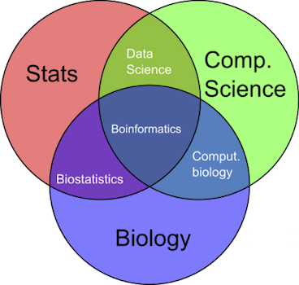
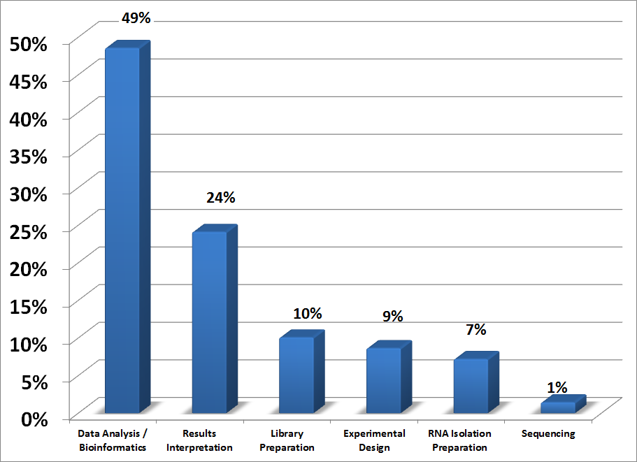
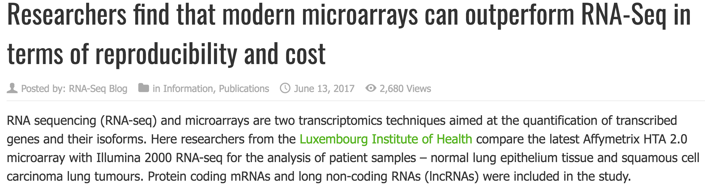

```{r setup, include=FALSE}
knitr::opts_chunk$set(echo = FALSE)
```

## Course logistics {.larger}

**Instructor**: Mikhail G. Dozmorov <mikhail.dozmorov@vcuhealth.org>, Ph.D.

**Schedule**: Monday, Wednesday 9:00am – 10:20am

**Classroom**: One Capital Square (OCS) 5009

**Office hours**: Mon, Wed 10:30am – 12:00pm, OCS 730

**Course documents**: https://blackboard.vcu.edu, https://mdozmorov.github.io/bios567.2017/ 

## Course prerequisites {.larger}

**Prerequisites**: BIOS 524 Biostatistical Computing, BIOS 553 Linear Regression, and BIOS 554 ANOVA

**Required text**: Sorin Draghici “Statistics and Data Analysis for Microarrays Using R and Bioconductor”, 2nd Ed., Chapman & Hall/CRC Press, 2012. ISBN-978-1-4398-0975-4.  
  - Supplemental reading and course materials will be provided in-class

**Software**: The R programming environment

## Computational Genomics

**Genomics/Bioinformatics (general)**

- Generation, organization, analysis and interpretation of biological data (initially genomic data) 

## Biostatistics

**Biostatistics**

- Class of statistical methods for dealing with large biological data sets 
- Goal: statistically identify significant changes in biological processes to answer relevant biological questions.
- High-throughput studies; get data matrix; mine the matrix for information

## Meet the curse of dimensionality

<center></center>

## Distributions to know

- <font color="green">Normal (Gaussian) distribution</font>
- <font color="blue">t distribution</font>
- <font color="blue">Chi-square distribution</font>
- <font color="green">F distribution</font>
- <font color="green">Binomial distribution</font>
- <font color="blue">Poisson distribution</font>
- <font color="green">Gamma distribution</font>
- <font color="green">Negative binomial distribution</font>
- <font color="green">Beta distribution</font>
- Beta Binomial distribution
- Multinomial distribution

<font color="blue">1 parameter</font>; <font color="green">2 parameters</font>; <font color="black">3 parameters</font>

## Bioinformatics {.smaller}

<center>

</center>

Data Scientist = statistician + programmer + coach + storyteller + artist

- Shlomo Aragmon

https://genomejigsaw.wordpress.com/2015/09/27/faq

## Data analysis

Which step of an RNA-Seq project do you find most intimidating?

<center></center>

http://www.rna-seqblog.com/rna-seq-blog-poll-results-25/

## Still microarray? {.larger}

- Microarray is still widely used because of lower costs, easier experimental procedure and more established analysis methods.
- Still around 50% of all publications annually.
- Similar problems are presented in newer technologies such as RNA-seq, and similar statistical techniques can be borrowed.

## Microarrays

Counts of papers per year in PubMed having the word `microarray`

```{r echo=FALSE, cache=TRUE}
library(ggplot2)
p <- MDmisc::get_pubmed_graph("microarray", yearstart = 1995, normalize = TRUE, xlab = "Proportion of 'microarray' publications", ylab = "Year")
plot(p)
```

## Microarrays today

<center></center>

http://www.rna-seqblog.com/researchers-find-that-modern-microarrays-can-outperform-rna-seq-in-terms-of-reproducibility-and-cost/

## Big data

<center></center>

<center></center>

## Expectations {.larger}

- Attend every class
- Read every assigned reading
- Complete all homework in time
- Be active in class. Ask questions
- Work hard - it will pay off


