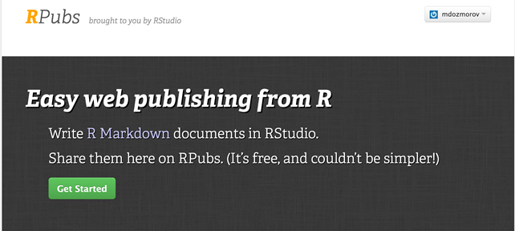

## The power of RMarkdown

We have seen that RMarkdown is an efficient and flexible tool for technical documentation

```{r, out.width = "300px", echo=FALSE}
knitr::include_graphics("img/bandThree2.png")
```

<http://rmarkdown.rstudio.com/>

## RMarkdown and RStudio

RStudio houses many tools for creating presentations, reports, web pages, etc.

Some tools require packages and provide templates

## R Presentations

- Default presentations in RStudio

- Written in RMarkdown

<center>

</center>

<https://support.rstudio.com/hc/en-us/sections/200130218-R-Presentations>


## Formatting R presentations | Beamer

- LaTeX-based document template for creating slides and presentations
- YAML setting: **`output: beamer_presentation`**
- YAML settings for **`theme`**, **`colortheme`**, **`fonttheme`**
- Markdown syntax can be mixed with LaTeX
- Presentation format: <http://rmarkdown.rstudio.com/beamer_presentation_format.html>
- Customizing Beamer slides:	<https://kbroman.wordpress.com/2013/10/07/better-looking-latexbeamer-slides>

## Formatting R presentations | ioslides

- Default format for RMarkdown presentations
- YAML setting: **`output: ioslides_presentation`**
- Markdown syntax can be mixed with HTML
- Presentation format:	<http://rmarkdown.rstudio.com/ioslides_presentation_format.html>
- Example: <https://github.com/mdozmorov/presentations/tree/master/reproducible_research/reproducible_research_2016-09-09>

## Formatting R presentations | others

- **Slidy**: a HTML-based slideshow

      1. YAML setting: **output: slidy_presentation**
      2. Tutorial/example: <https://www.w3.org/Talks/Tools/Slidy2/> 

&nbsp;

- **reveal.js**: the HTML presentation framework, highly customizable

      1. YAML setting: **output: revealjs::revealjs_presentation**
      2. Example: <http://lab.hakim.se/reveal-js/> 

## Slidify

- Customizable presentations in R Markdown. HTML-based. Can render presentations in any format.

- <http://slidify.org/>: 5 min video tutorial 

- Example: Slidify: 'Reproducible HTML Slides from R Markdown', <http://slidify.org/samples/intro/>

- Themes: <https://ramnathv.github.io/slidifyExamples/>

## Tufte-style handouts

- Distinctive style of text with sidenotes 


<https://www.wired.com/2003/09/ppt2/>

## Tufte-style handouts

Tufte Handouts are documents formatted in the style that Edward Tufte uses in his books and handouts. Tufte’s style is known for its extensive use of sidenotes, tight integration of graphics with text, and well-set typography

<center></center>

## Tufte-style handouts

- `tufte` package implements rendering `tufte_handouts`, `tufte_book`, `tufte_html`

- Installed as a template in RStudio once the `tufte` package is installed in R

- See the link for examples on accessing and formatting tufte-style reports:

<http://rmarkdown.rstudio.com/tufte_handout_format.html>

## Xaringan

- An R package with templates for presentations

- Find it here: <https://github.com/yihui/xaringan>

- See the example: <https://slides.yihui.name/xaringan/#1>

## Interactive reports

- Shiny - a web application framework for R, <http://shiny.rstudio.com/>

- Presentation format, <http://rmarkdown.rstudio.com/authoring_shiny.html>

- Generally used for exploratory data analysis


## Bookdown

- Authoring Books with R Markdown: <https://github.com/rstudio/bookdown>

- <https://bookdown.org/>: free books authored with bookdown

- Example: 'Bookdown: Authoring Books with R Markdown', <https://bookdown.org/yihui/bookdown/>

## Blogdown

- Authoring web pages with R Markdown: <https://github.com/rstudio/blogdown>

- Read about it here: <https://bookdown.org/yihui/blogdown/>


## Websites | GitHub pages

- A simple way to make a website using Markdown and git, <http://rmarkdown.rstudio.com/rmarkdown_websites.html>

- GitHub pages hosting, <https://pages.github.com/> - quick start on one page

- Example: 'Easy websites with GitHub Pages', <http://kbroman.org/simple_site/>


## Publishing articles

- LaTeX Journal Article Templates for R Markdown, <https://github.com/rstudio/rticles>


open access peer-reviewed scientific mega journal, <https://peerj.com/>

- Free preprint submission. Judges scientific/methodological rigor. Does not judge the results (may be null), interest or impact


<https://github.com/PeerJ/paper-now> 


## RPubs

- <http://rpubs.com/>: publishing R Markdown reports and presentation on the web
- Everything public
- Example: 'R Cookbook - Chapter 11 - Linear Regression and ANOVA', <http://rpubs.com/escott8908/RC11>

<center>

</center>

## Formulas in presentations

- **MathJax** - formula rendering engine accepting LaTeX, MathML, or AsciiMath syntax.
- Inline formula - decorate with **`$..$`**
    - e.g. `"... when $x < y$ we have ..."` 
    - becomes "... when $x < y$ we have ..."
- Self-standing equation - decorate with **`$$..$$`**
    - e.g. `$$\sum_{i=0}^n i^2 = \frac{(n^2+n)(2n+1)}{6}$$`
    - becomes $$\sum_{i=0}^n i^2 = \frac{(n^2+n)(2n+1)}{6}$$

<https://en.wikibooks.org/wiki/LaTeX/Mathematics>

<http://meta.math.stackexchange.com/questions/5020/mathjax-basic-tutorial-and-quick-reference>

