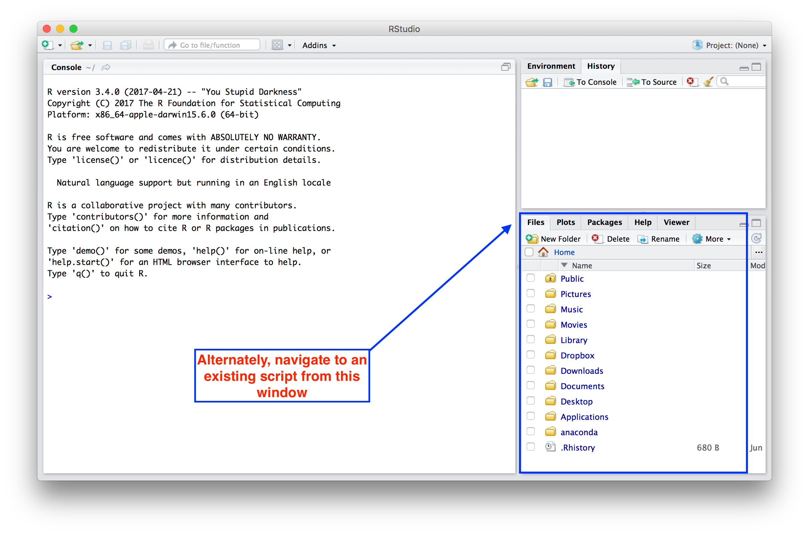
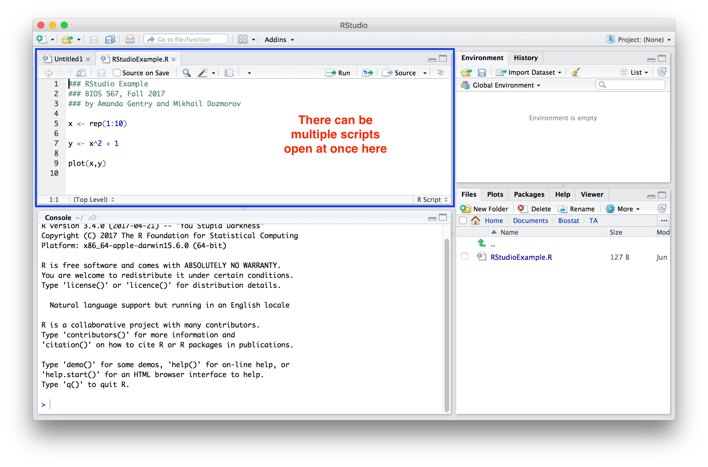

```{r setup, include=FALSE}
knitr::opts_chunk$set(echo = FALSE)
```

## RStudio

### What is it?

* RStudio is a program that allows you to run R in a more user-friendly environment
    * RStudio offers some GUI (graphical user interface) features for R
* RStudio can be considered a "portal"
    * The same R program is running underneath the interface
* RStudio is open-source software (and therefore is free)
    * Available for download at: http://rstudio.com
    
## RStudio 

Open RStudio and this is what you will see:


## RStudio 

Outlined in red is the R Console:


## RStudio 

You can open a new script in the editing window:


## RStudio 

Or you can open an existing script:



## RStudio 

There can be multiple scripts open in the editing window:



## RStudio 

History tab shows command run:


## RStudio 

Environment tab keeps track of the things the user defines:


## RStudio 

Plots appear in the plots tab (as expected):


## Getting help

- Is there a built-in function that does x? and if so,
- Where can i find it among the +2000 R Packages in CRAN?

- Use `?function_name` to get help on a function from a _loaded_ package
- Use `??function_name` to search for the function across all installed packages, even not loaded
- Use `apropos("part_of_function_name")` if you forgot the exact name, to get suggestions what the function name may be
- `library(sos)`, `findFn` function, e.g., findFn("cosine", maxPages=2, sortby="MaxScore")
- Search engine is your best friend on many things

## RStudio keyboard shortcuts

- Command (Ctrl) + Enter - Run current line/selection, go to the next line  
- Alt + Enter - Run current line/selection, stay on the current line
- Ctrl + 1 - Move cursor to source  
- Ctrl + 2 - Move cursor to console  
- Ctrl + L - Clear console
- Ctrl + Alt + I - Create new code chunk
- Ctrl + Alt + c - Run curret code chunk
- All the usual - Ctrl + Z, C, X, V, S, O

And more: https://support.rstudio.com/hc/en-us/articles/200711853-Keyboard-Shortcuts

## RStudio summary

### Why use it?

- Project-centric work - scripts and data are organized in one folder (project), easily accessible 
- Single workspace with four (rearrangeable, zoomable) panels
- Work on multiple projects simultaneously in several instances of RStudio
- Work on multiple (types of) scripts (rearrangeable tabbed interface)
- See all variables in R environment, easily visualize them
- Easy access to help, plots, packages
- Simple integration with Git version control system

## RStudio Tutorials

* http://dss.princeton.edu/training/RStudio101.pdf
* http://stcorp.nl/R_course/rstudio_tutorial.html
    * This tutorial describes RStudio's interaction with git
