```{r setup, include=FALSE}
knitr::opts_chunk$set(echo = FALSE)
```

## The Central Dogma of Molecular Biology

DNA is *transcribed* into RNA which is then *translated* into protein
<center>

</center>

## Expression of all genes define phenotypes {.larger}

- Mendelian genetics explains transmission of genetic information, but sheds no light on how genes create cellular and organismic phenotypes.

- Assays have been developed to more formally study **the association between genes and phenotypes**.

## Rules of base pairing

<center>

</center>

- All genetic code is spelled out with just four chemical letters, or bases: adenine (A), thymine (T), cytosine (C) and guanine (G)
- These pair up, A with T and C with G

## Complementary hybridization

<center>

</center>

- Two single-stranded DNA molecules whose sequences are complementary to each other will exhibit a tendency to bind together to form a single double-stranded DNA molecule. This process is called **hybridization**.

## Complementary hybridization

- Sequence fully complementary to a target will hybridize with much higher efficiency than partially complementary.

<center>

</center>

- Even when the sequences on the two strands do not match perfectly, as long as there is sufficient **overall** similarity, it is likely that some base pairing will occur.

<center>
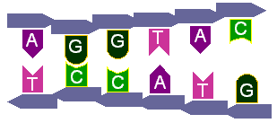
</center>

## Complementary hybridization

- The tendency of DNA strands of complementary sequences to hybridize is exploited in hybridization assays.
- A **probe** consisting of a homogeneous sample of single-stranded DNA molecules, whose sequence is known, is prepared and **labeled with a reporter** fluorescent chemical
- An **immobilized target**, usually a single-stranded DNA molecule, is challenged by the probe.
- As the probes will hybridize preferentially to sequences complementary to the targets, they can be identified by the presence of fluorescence.
- Location of the targets, and the amount of fluorescence, defines which genes, and how much, are expressed.

## What is a Microarray? {.larger}

- "A DNA microarray is a multiplex technology consisting of thousands of oligonucleotide spots, each containing picomoles of a specific DNA sequence."

- An _oligonucleotide_ (from Greek prefix _oligo_-, "having few, having little") is a short nucleic acid polymer.

## What Are Microarrays Used For? 

- Various molecular assays
<center>

</center>

## What Are Microarrays Used For?

- Biological insights
<center>

</center>

## Microarrays measure expression of all genes {.larger}

- Traditional molecular biology research followed a "*one gene per experiment*" paradigm
- With the advent of microarrays, research practice has moved from a "one gene at a time" mode to "thousands of genes per experiment" 
- Allows for the study of how genes function _en masse_

## Basic Design of Expression Arrays {.larger}

- For **each gene** that is a target for the array, we have a **known DNA sequence**
- Microarrays are composed of short DNA sequences complementary to the target genes
- These sequences are attached to a slide at high density 

## Basic Design of Expression Arrays {.larger}

- mRNA is reverse transcribed to cRNA, and if a complementary sequence is on the on a chip, the cRNA will be more likely to hybridize to it
- The cRNA is labeled with a dye that will fluoresce and generate a signal that is monotonic with the amount of the mRNA sample
- The amount of hybridization can be **quantitatively** measured by the amount of fluorescence

## Microarray types {.larger}

- Two major types of microarrays
1. **Spotted arrays**, typically _two-channel_
2. **Oligonucleotide arrays**, typically _single-channel_

## Different High-throughput Technology

<center>
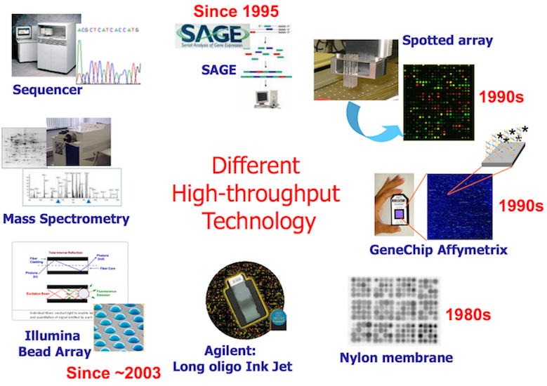
</center>

## Spotted Arrays

- Robotically printed onto a series of glass slides using a robot with needle-heads.
<center>
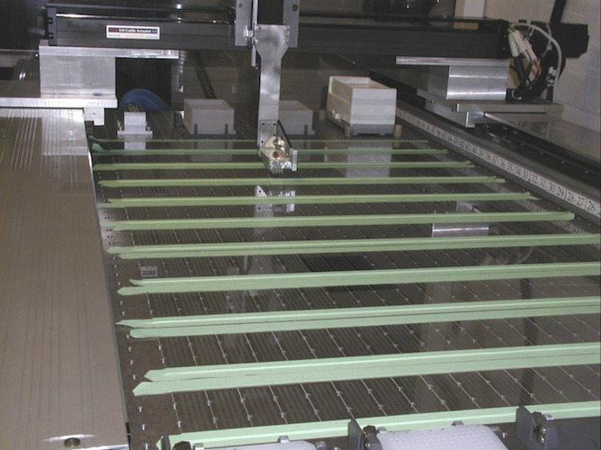
</center>

## Spotted Arrays

- Printing produce a characteristic gridding pattern and almost always use two samples simultaneously (two-color).
<center>
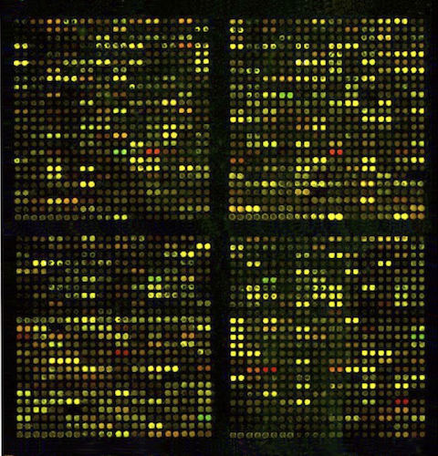
</center>

## How two-channel arrays work? {.larger}

- Use two samples, control (reference) and test, e.g., tumor and normal cells.  Take identical amounts of mRNA and convert to cDNA
- Incorporate <span style="font-weight:bold; color:green;">GREEN</span> fluorescent dye into one cDNA (e.g. control)
- Incorporate <span style="font-weight:bold; color:red;">RED</span> fluorescent dye into the other (e.g. test)
- Hybridize mixture of both onto array. <span style="font-weight:bold; color:green;">GREEN</span> spot indicates mRNA expression only in control sample, <span style="font-weight:bold; color:red;">RED</span> - in test sample, <span style="font-weight:bold; color:orange;">ORANGE</span> - in both

## Two-channel (two-color) arrays

<center>
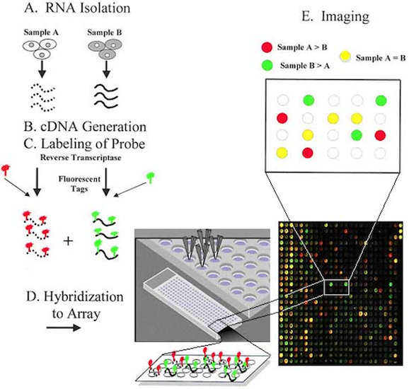
</center>

## Combine scans for Red & Green {.larger}

<center>
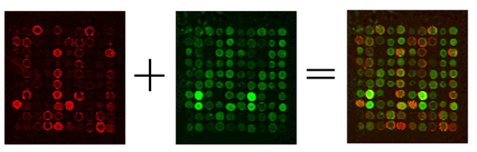
</center>
- False color image is made from digitized fluorescence data, not by superimposing scanned images.

<http://www.bio.davidson.edu/courses/genomics/chip/chip.html>

## Two-channel arrays {.larger}

- Advantages 
1. Assessment of gene expression in two samples on a single array
2. Two samples have the same background variability on the array
3. Typically, longer molecules are used, so non-specific binding is not much of a problem

## Two-channel arrays {.larger}

- Disadvantages
1. More laborious, need to handle two samples
2. Each channel may behave differently
3. Typically, one spot per gene - optical noise is a concern
4. Normalization of microarray data WITHIN and BETWEEN the arrays is still needed

## Single-channel arrays

<center>

</center>

## Single-channel arrays

- mRNA extraction from one sample
- cRNA synthesis and fluorescent dye-labeling
- cRNA hybridization onto array
- Scanning and quantification of fluorescence of each spot

<center>

</center>

## Oligonucleotide Arrays | Affymetrix arrays

<center>

</center>

<https://youtu.be/MRmpeBTwwWw>

## RNA Wash

<center>

</center>

## RNA Wash

<center>

</center>

## Affymetrix array design {.larger}

- Rather then an entire gene being placed in a Affymetrix Genechip is an oligonucleotide array consisting of a several **perfect match** (PM) and their corresponding **mismatch** (MM) probes that interrogate for a single gene. 

1. PM probe is the exact complementary sequence of the target genetic sequence, composed of 25 base pairs 

2. MM probe, which has the same sequence with exception that the middle base (13th) position has been reversed 

3. There are roughly 11-20 PM/MM probe pairs that interrogate for each gene, called a probe set 

## Affymetrix array design

<center>
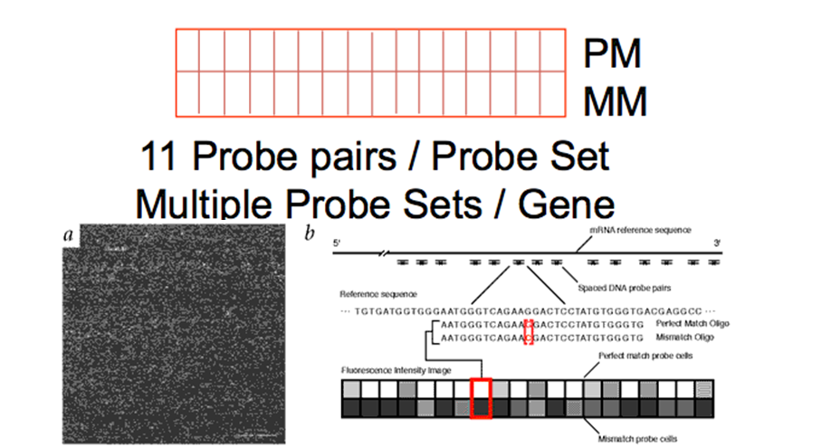
</center>

## Affymetrix files {.larger}

- **DAT** file: Image file, $~10^7$ pixels, ~50 MB.
- **CEL** file: Cell intensity file, probe level PM and MM values.
- **CDF** file: Chip Description File. Describes which probes go in which probe sets and the location of probe-pair sets (genes, gene fragments, ESTs). 

## Alternative splicing

<center>

</center>

## Exon array principles {.larger}

- Gene-level and exon-level detection of expression.
- Allow detection of alternative splicing mRNA transcripts.

## Exon array design {.larger}

- PSR - Probe Selection Region
<center>

</center>

## Affymetrix exon arrays {.larger}

- Affymetrix GeneChip **Exon** 1.0 ST
1. Wide coverage
2. Well annotated genes plus gene prediction sets
3. Over 1.4 million probe sets

## The use of exon array {.larger}

- Advantages

1. Allow detection of alternative splicing.

2. Cost is about the same as for regular microarrays.

## The use of exon array {.larger}

- Disadvantages

1. Careful probe design is imperative.

2. Methods for analysis are not well developed.

## Self-Assembling Bead-Arrays {.larger}

- Made by Illumina
- 3 $\mu$m silicon beads, randomly spread across the surface of the chip
- Each bead coated with ~105 identical 50bp probes
- Each probe has identifying barcode (address) sequences
- ~30 beads per gene

<center>

</center>

## Illumina Bead Arrays {.larger}

Beads form array on light fibers.

<center>
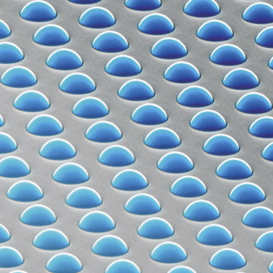
</center>

## Illumina Bead Arrays

Illumination from below excites fluorescence – quantifies probe bound.

<center>
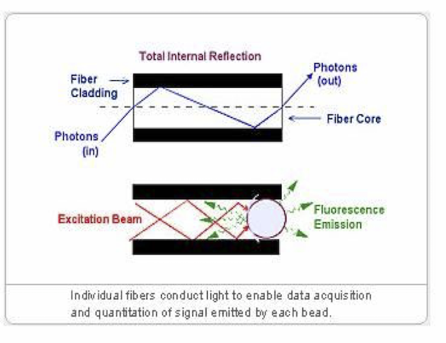
</center>

## Illumina Bead Arrays {.larger}

- Each chip of the Ref-8 contains 8 arrays with ~ 25,000 targets, plus controls

- Each chip of the WG-6 contains 6 arrays with ~ 50,000 targets, plus controls

- Each chip of the HT-12 chip contains 12 arrays with ~ 50,000 targets and controls

## The use of single-channel arrays {.larger}

- Advantages

1. Analysis of ONE sample per array

2. Straightforward approach - more fluorescence = more RNA

## The use of single-channel arrays {.larger}

- Disadvantages

1. Need to use another array(s) for comparative analysis

2. Careful normalization of one microarray data to the other is a must

## InkJet Arrays

<center>

</center>

The new company wanted to determine if **printer** technology could be harnessed to generate microarrays.

***

Inkjet Array Manufacture Involves Sequential Nucleotide Addition

<center>
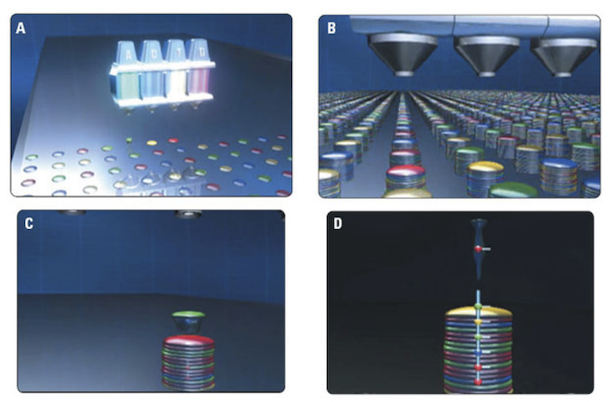
</center>

## Genome-wide genotyping panels {.larger}

- 10,000-5 million variants 
- Affymetrix, Illumina
- Random SNPs
- Selected haplotype tag variants
- Copy number probes
- More lower frequency variants
- Exome variants
- Some arrays allow variants to be added

## SNP arrays {.larger}

- Affymetrix SNP Array 5.0 (500,568 SNPs) and SNP Array 6.0 (934,968 SNPs)
- Illumina HumanHap300 (317,511 SNPs), HumanHap550 (555,352 SNPs), HumanHap650Y (660,917 SNPs), and Human1M (1,072,820 SNPs)

<center>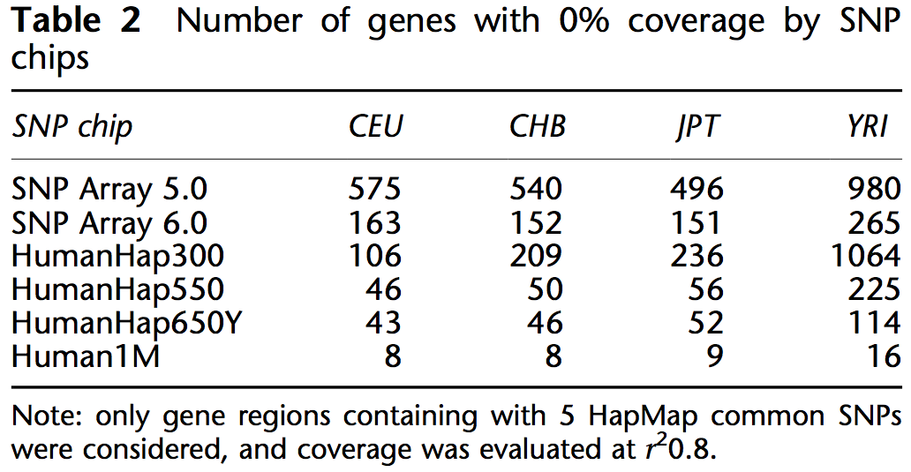</center>

https://www.nature.com/ejhg/journal/v16/n5/full/5202007a.html


## Tiling arrays: Biological motivations {.larger}

- There are many types of "events" happen at different locations on the genome. 
- For example, protein bindings, epigenetic modifications (DNA methylation and histone modifications), copy number variations, etc.
- It is often of great interest to detect the genomic locations where a specific event happens, or quantify the events along the genome.

## An example: transcription factor (TF) binding {.larger}

- Transcription factors(TF): proteins that bind to specific DNA sequences and control the transcription from DNA to mRNA.
- There are many different types of TFs, each recognize different DNA sequences (motifs).
- The functions of the TFs are important for understanding gene regulatory mechanisms.
- The first step toward the understanding is to detect the TF binding sites (TFBS).

## Tiling arrays {.larger}

- The goal is to quantify the events of interests along the genomes, and/or detect the genomic coordinates for the events.
- Work the same as gene expression array (hybridization based), except that the probes are designed to tile up the genome at non- repeat regions.
- Data for probes in the location of interest often behave differently from backgrounds (e.g., bigger intensities).

<center>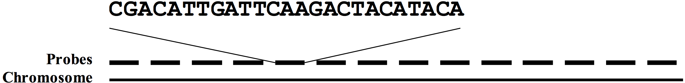</center>

## Types of tiling arrays {.larger}

- **ChIP-chip**: Chromatin ImmunoPrecipitation (ChIP) + tiling array (chip) for detecting transcription factor binding sites or measuring histone modification levels.
- **MeDIP-chip**: Methyl-DNA ImmunoPrecipitation (MeDIP) + tiling array (chip) for measuring DNA methylation level.
- **ArrayCGH** (Comparative Genomic Hybridization) for detecting copy number variations.

There’s no major differences in array designs. Difference are the ways to prepare biological samples.

## Copy number alterations (CNA) can lead to disease {.columns-2}

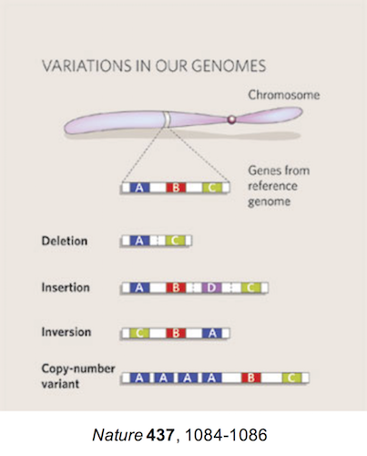

- CNAs are a hallmark of tumor genomes

- CNAs can lead to adverse expression changes of affected genes 

- Recurrent CNAs in patients with common phenotype potentially represent molecular markers of disease

- Task: find recurrent CNAs for diagnostics, gene-disease association, disease susceptibility

## Array comparative genomic hybridization {.larger}

 - **aCGH (Array CGH)**. A technique based on competitively hybridizing fluorescently labelled test and reference samples to a known target DNA sequence immobilized on a solid glass substrate and then interrogating the hybridization ratio.
- The signal ratio between a test and reference sample is normalized and converted to a log ratio, which acts as a proxy for copy number
- An increased log ratio 2 represents a gain in copy number in the test compared with the reference; conversely, a decrease indicates a loss in copy number

## Measuring CNAs with array comparative genomic hybridization (aCGH) {.larger}

- Array hybridization - similar to two-color array studies:
1. Test DNA sample - Unknown DNA copy number
2. Reference DNA sample - normal karyotype DNA copy number
3. Label, mix, hybridize, scan

- Array analysis - resulting data are normalized, log test over reference intensities for genomic targets

## Measuring CNAs with aCGH

- aCGH -  array comparative genomic hybridization
<center>
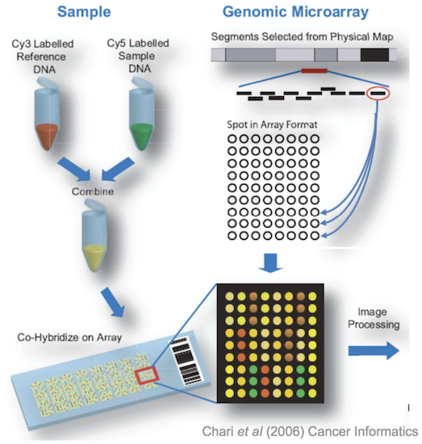
</center>

## Detecting copy number alterations

<center>
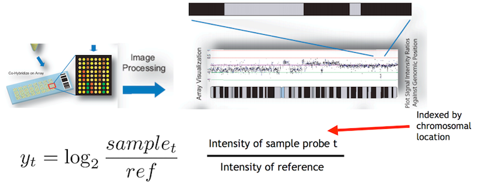
</center>

## Example copy number alterations in cancer

<center>
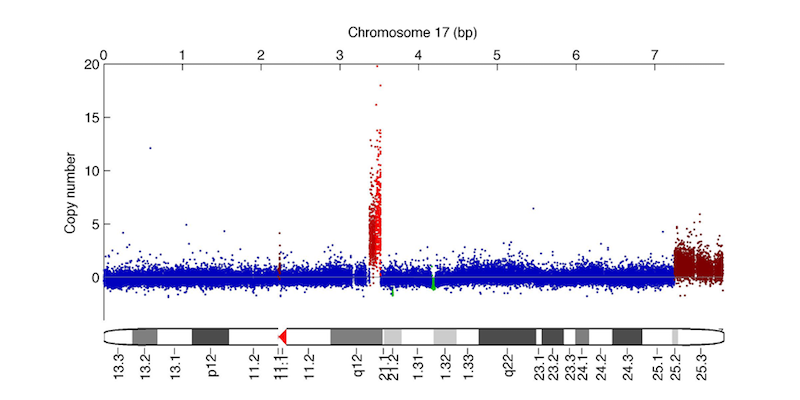
</center>


## SNP microarrays

Hybridization-based assays in which the target DNA sequences are discriminated on the basis of a single base difference. Assays are processed with a single sample per array and perform both SNP genotyping and copy-number interrogation.

- B allele frequency (BAF) metric - the proportion of the total allele signal (A + B) explained by a single allele (A). 
- The BAF has a significantly higher per-probe SNR than the log ratio data and can be interpreted as follows: 
  - a BAF of 0 represents the genotype (A/A or A/–), whereas 0.5 represents (A/B) and 1 represents (B/B or B/–). 
- Different BAF values occur for AAB and ABB genotypes or more complex genotypes (for example, AAAB, AABB and BBBA). Homozygous deletions result in a failure of the BAF to cluster. Thus, the BAF may be used to accurately assign copy numbers from 0 to 4 in diploid regions of the genome. 
- The BAF also allows detection of copy-neutral events such as segmental uniparental disomy (segmental UPD) or whole-chromosome UPD and identity by descent (IBD), which results when a segment of one chromosome is replaced by the other allele without a change in copy number (this is therefore not detectable by array CGH).

## aCGH vs SNP arrays

<center>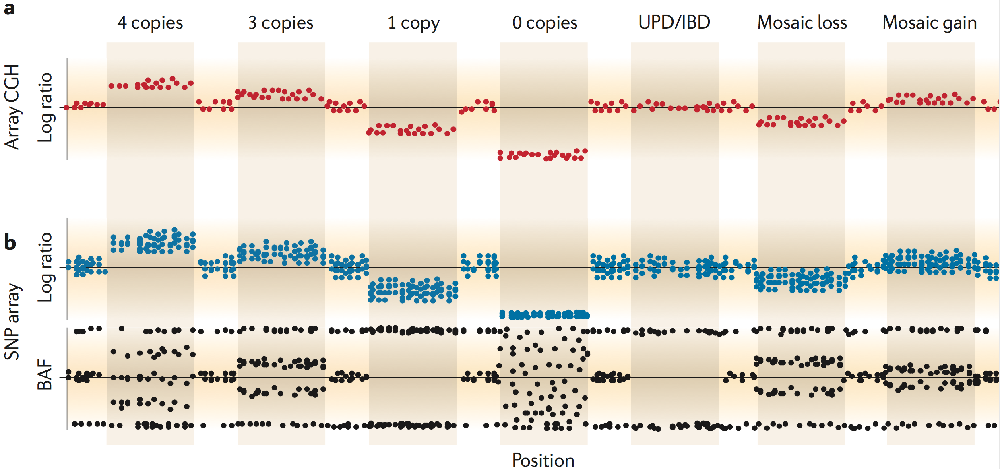</center>

Limitations of both - repetitive regions

## Tiling array data analysis {.larger}

- Goal: detect locations of interests (also called “peaks”) based on probe locations and signals.  
- Normalization: remove technical artifacts.  
- Detection of regions of interests:  
  – Data from neighboring probes need to be combined to make inference, because the regions of interests often overlap many probes.  
  – Easiest method: moving average, then use an arbitrary cutoff.  
  – Many different methods.  

## Popular software

For ChIP-chip:  
– CisGenome, http://www.biostat.jhsph.edu/~hji/cisgenome/
– MAT, http://liulab.dfci.harvard.edu/MAT/

CNVarrays:  
– Affymetrix:  
  - APT: uses a hidden Markov model, https://www.thermofisher.com/us/en/home/life-science/microarray-analysis/microarray-analysis-partners-programs/affymetrix-developers-network/affymetrix-power-tools.html  
  - R package VanillaICE: HMM based.   https://www.bioconductor.org/packages/release/bioc/html/VanillaICE.html
  - R package DNAcopy: Circular Binary Segmentation.   https://bioconductor.org/packages/release/bioc/html/DNAcopy.html  
– Illumina:  
  - QuantiSNP: https://sites.google.com/site/quantisnp/  
  - PennCNV: http://penncnv.openbioinformatics.org/en/latest/  

## Tiling arrays Summary {.larger}

- Tiling arrays are DNA microarrays for detecting locational modifications of genome.
- Probes tile up a part of whole genome.
- Still hybridization based (DNA segments stick to probes), same as gene expression arrays.
- Location of interests shows some patterns: peaks for TFBS, or plateau for CNV.
- Need to combine data from neighboring probes to make calls.
- Being replaced by sequencing (e.g., ChIP-seq).

## Additional Microarray Platforms

<center>

</center>


# Applications of microarrays {.larger}

## All areas of life sciences

- **Cancer research**: Molecular characterization of tumors on a genomic scale; more reliable diagnosis and effective treatment of cancer 

- **Immunology**: Study of host genomic responses to bacterial infections 

- **Model organisms**: Multifactorial experiments monitoring expression response to different treatments and doses, over time or in different cell types 

## Typical comparisons {.larger}

- Compare mRNA transcript levels 
1. different type of cells, tissues (e.g., liver vs. brain)
2. treatment (Drugs A, B, and C)
3. disease state (tumor vs. normal)
4. different organism (yeast, different strains) different timepoints

## Normal vs. cancerous cells {.larger}

- All cells in the body are the lineal descendants of a fertilized egg. Almost all of these cells carry genomes that are reasonable accurate copies of the genome that was initially present in the fertilized egg

- However, cells throughout the body are phenotypically distinct (e.g., skin cells versus brain cells) though genetically identical.

- **Differentiation** is the process whereby cells in different parts of the embryo begin to assume distinct phenotypes. 

- The molecular mechanisms of differentiation can be understood by examining the sets of genes that are expressed (transcribed) in some cells but not others. These are tissue-specific genes. 

## Cancer {.larger}

- Cancer is a disease in which cells escape the restraints on normal cell growth, and become less and less differentiated

- Once a cell has become cancerous, all of its descendant cells are cancerous

- Clonal expansion of cancer cells results in cancer progression

## Hallmarks of cancer

<center>
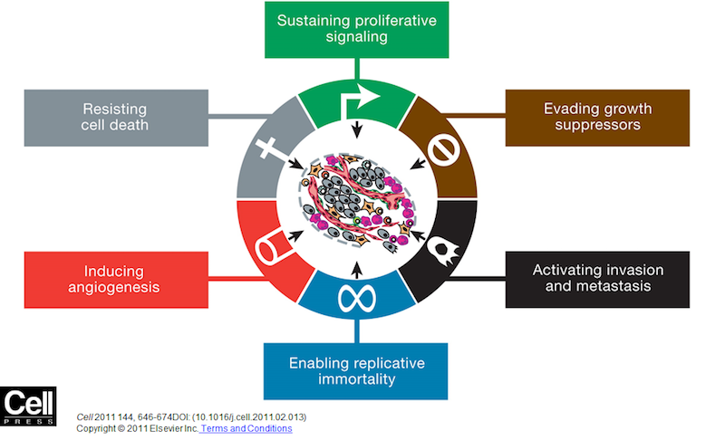
</center>

## Genetic abnormalities in cancer {.larger}

- Mechanisms whereby mutations and genetic alterations cause cancer 
1. Gain of function (proto-oncogene)
2. Loss of function (tumor suppressor gene)
3. Translocations - creation of chimeric proteins with novel function
4. Aberrant gene expression
5. Epigenetic changes

## Clinical cancer detection

- Pathologist makes an interpretation based upon a compendium of knowledge which may include 
1. Morphological appearance of the tumor
2. Histochemistry
3. Immunophenotyping
4. Cytogenetic analysis 
5. etc. 

<center>
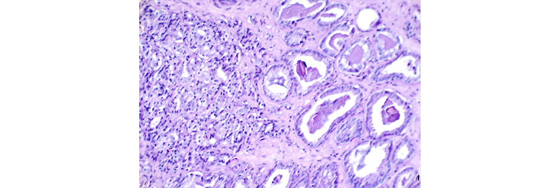
</center>

## Microarrays in cancer detection {.larger}

- Applications of microarrays

1. Characterize molecular variations among tumors by monitoring gene expression 

2. Divide morphologically similar tumors into different groups based on gene expression. 

- Goal: microarrays will lead to more reliable tumor classification and sub-classification (therefore, more appropriate treatments will be administered resulting in improved outcomes) 

