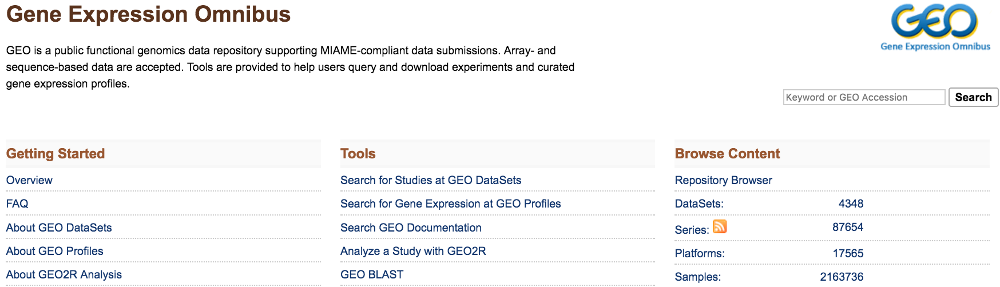
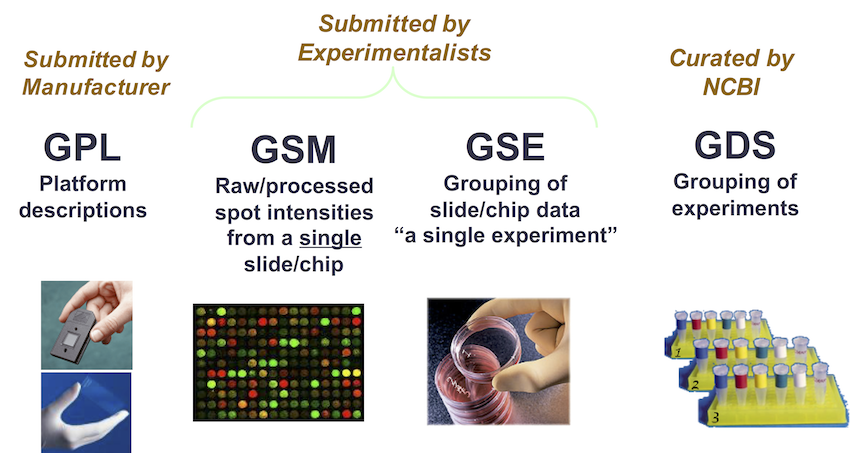
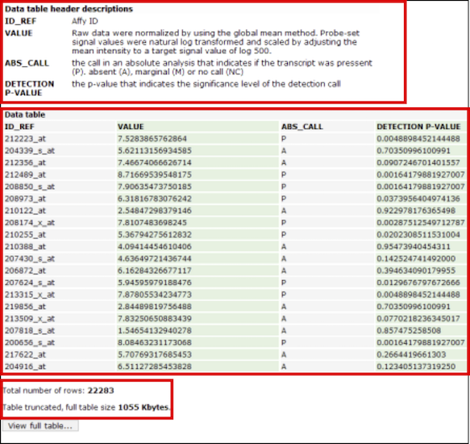
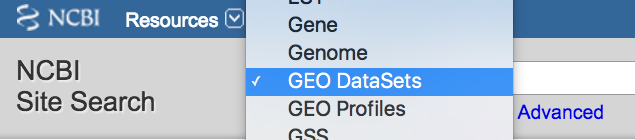
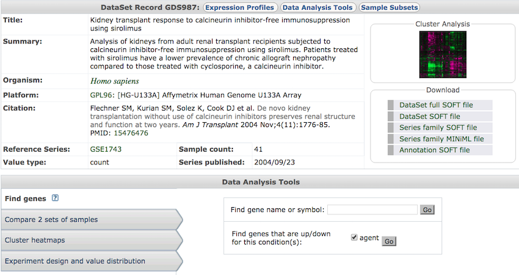

## GEO, Gene Expression Omnibus

<https://www.ncbi.nlm.nih.gov/geo/>

## GEO Structure {.larger}

- **Platform** (GPL) - Annotation the technology and the features

- **Sample** (GSM) - Submitter-supplied sample data

- **Series** (GSE) - A collection of biologically- and statistically- comparable samples processed using the same platform

- **DataSets** (GDS) - Data collections assembled by GEO staff.

## GEO Structure

## Platform page  {.larger}

<https://www.ncbi.nlm.nih.gov/geo/query/acc.cgi?acc=GPL570>

Platform details:

- Description
- Type
- Organism
- Manufacturer
- Related samples and series

## Sample page {.larger}

<https://www.ncbi.nlm.nih.gov/geo/query/acc.cgi?acc=GSM543663>

Sample details:

- Description
- Type
- Organism
- Source
- Related platforms and series

## Sample data preview | Field description, truncated view, total rows

## Series page {.larger}

<https://www.ncbi.nlm.nih.gov/geo/query/acc.cgi?acc=GSE21862>

Series details:

- Biological sample summary
- Design summary
- Publication information
- Related platforms and samples

## Search DataSet or Gene profile  {.larger}

&nbsp;

- Datasets: **experiment-centric** view and analysis
- Gene profiles: **gene-centric** view

<https://www.ncbi.nlm.nih.gov/>

## GEO DataSet analysis

<https://www.ncbi.nlm.nih.gov/sites/GDSbrowser?acc=GDS987>

## ArrayExpress

<https://www.ebi.ac.uk/arrayexpress/>

&nbsp;

... and more <https://en.wikipedia.org/wiki/Microarray_databases>, <https://datamed.org/>

