```{r setup, include=FALSE}
require(knitr)
hook_source_def = knit_hooks$get('source')
knit_hooks$set(source = function(x, options){
  if (!is.null(options$verbatim) && options$verbatim){
    opts = gsub(",\\s*verbatim\\s*=\\s*TRUE\\s*", "", options$params.src)
    bef = sprintf('\n\n    ```{r %s}\n', opts, "\n")
    stringr::str_c(bef, paste(knitr:::indent_block(x, "    "), collapse = '\n'), "\n    ```\n")
  } else {
     hook_source_def(x, options)
  }
})
```

## Image analysis {.larger}

The raw data from a microarray experiment is a series of scanned images.

- Images must be converted into quantitative data
- Steps to preprocess and transform the image into a format suitable for analysis are under the realm of "image analysis."

***
<center>

</center>

<div class="footer">
Source:  Halliday D. and Resnick, R. (1988) Fundamentals of Physics, Third Edition. 
Johm Wiley & Sons, New York, page 844.
</div>

## Custom spotted arrays {.larger}

- One array has two images
1. Cy3 dye, green channel, 510 - 550 nm
2. Cy5 dye, red channel, 630 - 660 nm

- These channels are distinguished by a scanning instrument
- Data for each channel are stored as monochromatic images

## Illumina Green channel

<center>
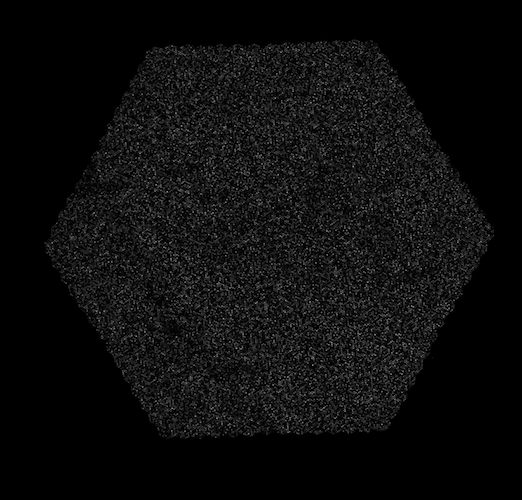
</center>

## Illumina Red channel

<center>
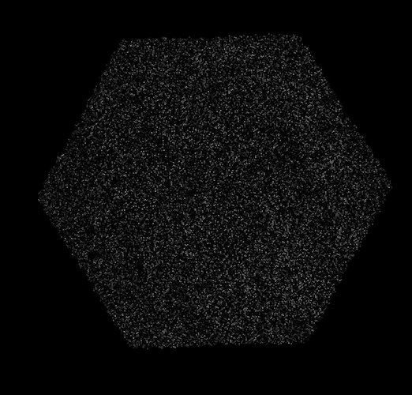
</center>

## Computer representation of images {.larger}

- Consider the computer image to be a two dimensional array (matrix) of numbers.
- The smallest element of the image is a pixel. 
- For an image with M x N pixels, each pixel has location $(x,y)$. 
- Each pixel has an intensity value $f(x,y)$, and the size of the pixel is $\Delta x*\Delta y$.

## Computer representation of images

<center>
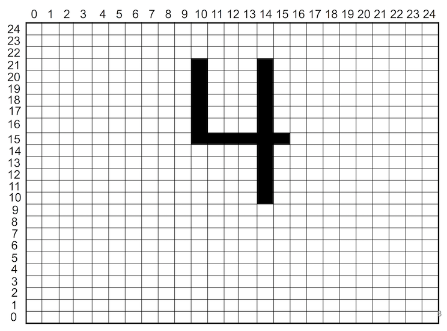
</center>

## Computer representation of images {.larger}

- For a monochromatic image, $f(x,y)$ is an integer called a _grayscale value_ where $f = {f(x,y): x = 0, 1,..., M-1; y=0, 1,..., N-1}$.
- Therefore, each $f(x,y)$ represents the brightness of a small picture element, called pixel, at location $(x,y)$. 

- The number of pixels contained in a digital image is called *resolution*

## Computer representation of images {.larger}

- Pixel intensity values are stored as binary numbers. 
- Binary numbers are sequences of 0's and 1's. 
- A binary digit (usually abbreviated 'bit') can hold one binary digit, a 0 or a 1. 

## Computer representation of images {.larger}

- For a one-bit digital image, the computer uses one bit to represent a pixel value. The pixel is either 0 (black) or 1 (white). 
- In a two-bit digital image, the computer uses two bits to represent a pixel value. The pixel may be 00 (black), 11 (white), or one of two shades of gray (10 or 01). 

## Computer representation of images

- A sequence of eight binary digits is called a byte. 
- For example, using 8 bits, write the number 87. 

## Computer representation of images

- A sequence of eight binary digits is called a byte. 
- For example, using 8 bits, write the number 87. 


 2^7=128 |  2^6=64 |  2^5=32 |  2^4=16 |  2^3=8  |  2^2=4  |  2^1=2  |  2^0=1 
---------|---------|---------|---------|---------|---------|---------|--------
    0    |     1   |    0    |     1   |     0   |    1    |    1    |    1   

&nbsp;

$128*0  +   64*1  +  32*0   +   16*1  +   8*0   +   4*1   +   2*1   +  1*1$

## Computer representation of images {.larger}

- Most images are stored using n-bits; there are $2^n$ possible binary sequences of length n. 
- For example, an 8 bit (one byte) image has $2^8$ possible values ranging from $0$ to $2^8-1$; $0$ (black), $255$ (white), and $254$ gray levels. 
- The radix is 2 so each number is represented as linear combination of powers of 2. 

## Pixel intensity (color depth)

&nbsp;

<center>
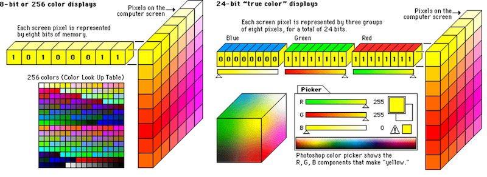
</center>

## What do we finally get {.larger}

- *Digital image*: rectangular array of intensity values
- Each intensity value corresponds to a *pixel*
- *Color Depth*: is the number of bits used to store the intensity value of one pixel

Color depth of 16 bits/pixel (common for microarray scanners) means the intensity values of each pixel is an integer between $0$ and $65,535 (=2^{16}-1)$

***

<center>
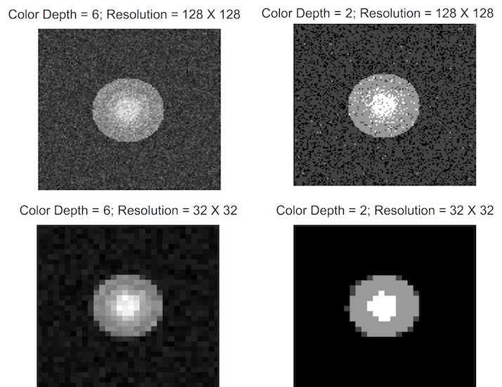
</center>

## Steps in image analysis {.larger}

- **Addressing**: locate the spots
- **Segmentation**: categorize each spot as foreground (signal), background, or other
- **Intensity extraction**: assign signal and background values to each spot
- **Spot quality assessment**: compute measures of spot quality for each spot

These steps use specialized software and can involve varying degrees of human intervention.

## ImageJ

<http://imagej.nih.gov/ij/>

&nbsp;

<http://image.bio.methods.free.fr/ImageJ/?Protein-Array-Analyzer-for-ImageJ.html&artpage=5-6>

## Addressing: Custom Spotted Arrays

- Custom spotted arrays are manufactured by a robotic system that uses several print tips (pins, pinheads) to deposit the cDNA fragments on each of the spots. 

- Typically each of the _n_ print tip spots in a regular sized sub-grid, such that the entire microarray is composed of _n_ matrices with the same number of rows and columns. 

- Ideally, the spots are of the same size, the same shape and are equally spaced throughout the array. 

<center>
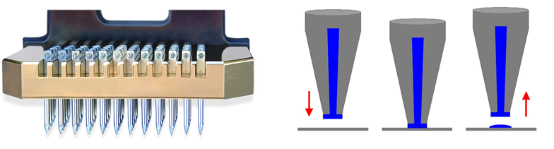
</center>

## Microarray Layout Parameters {.larger}

- The ultimate goal of any image analysis technique should be the automation of the image analysis process. 

- Although the layout of the cDNA array is known and can be used for addressing, the known model must be matched to the scanned image. 

- Therefore, most software packages include both automatic and manual procedures for addressing. 

## Addressing

<center>
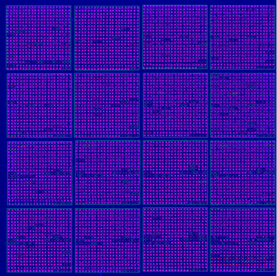
</center>

## Microarray Layout Parameters {.smaller}

| Microarray Layout Parameters | Value |
|------------------------------|-------|
| Array Rows                   | 4     |
| Array Columns                | 4     |
| Rows                         | 21    |
| Columns                      | 21    |
| Array Row Spacing            | 9000  |
| Array Column Spacing         | 9000  |
| Spot Row Spacing             | 425   |
| Spot Column Spacing          | 425   |
| Spot Diameter                | 300   |
| Spots per Array              | 441   |
| Total Spots                  | 7056  |

## Segmentation {.larger}

- Once the address of the spots has been identified, the pixels must be classified as signal versus background, a process called _segmentation_. 

- Background represents a value of the measured signal intensity that is presumed to be due to non-specific binding of target to the probe

- Thought to be removed from the signal intensity measurement in order to accurately quantitate the amount of target RNA present in the sample. 

## Foreground vs. Background {.larger}

Uneven hybridization, auto fluorescence,  non-specific binding - measurements outsize the spot not at 0 intensity


<center>
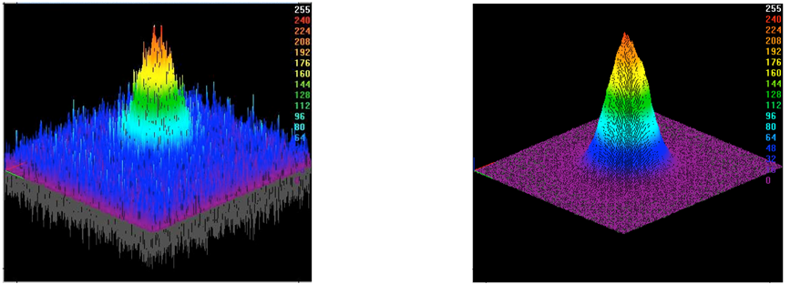
</center>

## Segmentation {.larger}

Spatial based segmentation: 

- fixed circle
- adaptive circle
- adaptive shape

&nbsp;

Intensity-based segmentation

- Ranked intensities
- Mann-Whitney method

## Segmentation

<center>
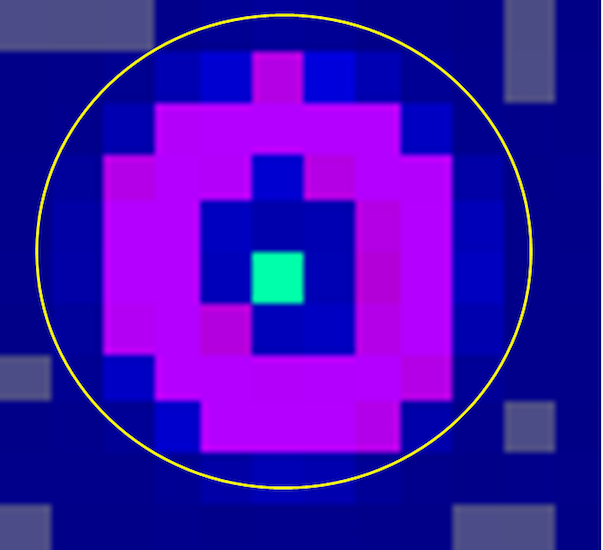
</center>

## Segmentation

<center>
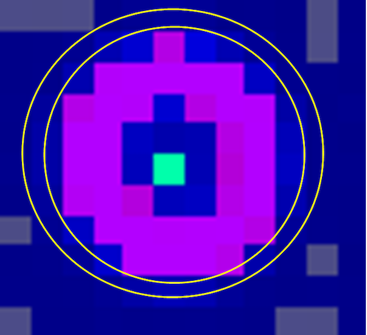
</center>

## Segmentation

<center>
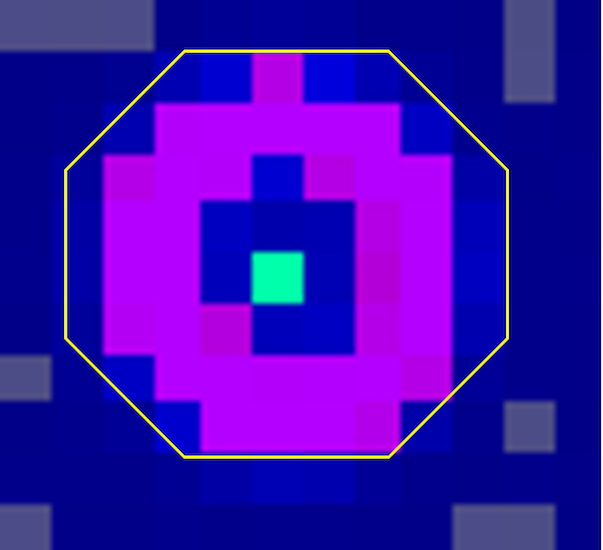
</center>

## Ranked intensities {.larger}

- Get intensities of all pixels in a rectangluar region
- Estimate the number of pixels in a circle fitted in this region
- Select this number of intensities from the ranked list of all intensities

## Ranked intensities {.larger}

- A rectangular region, $40x40$ pixels: a total of 1600 pixels
- Assume signal spot being 20 pixels in diameter: contains $\pi *10^2 = 314$ pixels, or $~20%$
- Select $20%$ top intensities from the ranked list of all 1600 intensities

## Mann-Whitney method {.larger}

- Chen et al (1997)

Chen Y, Dougherty ER, Bittner ML. "Ratio-based decisions and the quantitative analysis of cDNA microarray images." J Biomed Opt. 1997. PMID: 23014960 

<http://bcb.dfci.harvard.edu/~gp/teaching/688/chen1997.pdf>

## Issues with background subtraction {.larger}

- Again, the purpose of segmentation is to partition pixels into one of two classes, foreground versus background.
- Most often, correcting for background takes on the form of subtracting the estimate for background from the estimate from signal.
- Subtracting background has been noted to increase the variability of genes, particularly at low levels of expression. 

## Intensity Extraction {.larger}

Spot intensity: Some statistics representing intensities for all pixels in spot area; similarly for background intensity

- **Mean**: mean of pixel intensities
- **Median**: median of pixel intensities
- **Mode**: location of peak in histrogram of intensities
- **Area**: number of pixels
- **Total**: sum of pixel intensities

Still, no consensus what to use

## Intensity Extraction {.larger}

- The underlying principle that should be used to guide the selection of a method for data quantification is to select the statistical summary that best correlates with the amount of DNA target in the hybridized sample.
- **L-estimators** - linear combination of order statistics

## Image processing for oligo arrays {.larger}

- Affymetrix Genechips use propriety Affymetrix software
- Genechip surface covered with square shaped cells containing probes
- Probes are synthesized on the chip in precise locations
- Thus spot finding and image segmentation are not major issues

## Image Analysis: Pixel Level Data

6 x 6 matrix of pixels for each PM and MM probe HG-U133A GeneChip

<center>
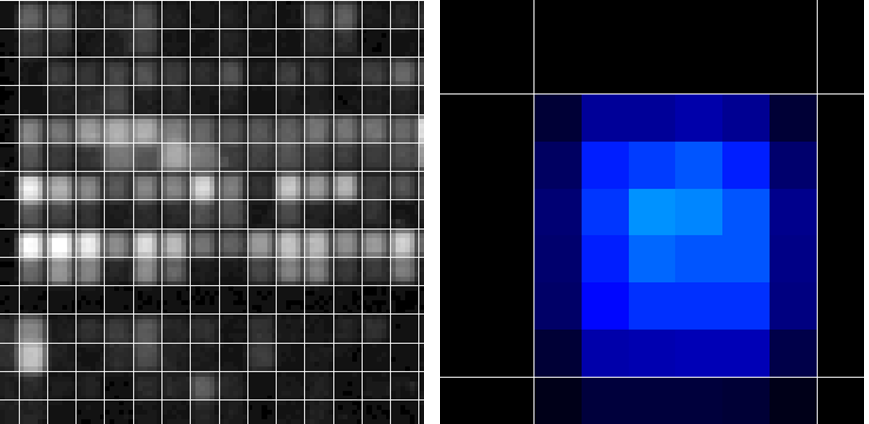
</center>

## One Affymetrix probe {.columns-2}

- $8 x 8 = 64$ pixels
- Border pixels excluded
- 75th percentile of the 36 pixel intensities corresponding to the center 36 pixels is used to quantify fluorescence intensity for each probe cell
- These values are called PM values for perfect-match probe cells and MM values for mismatch probe cells
- The PM and MM values are used to compute expression measures for each probe set

<p class="forceBreak"></p>

<center>
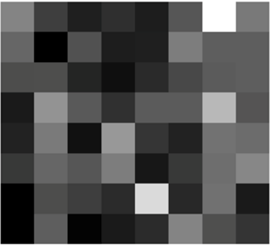
</center>

## Intensities for one Affy PM cell

--------- -------- -------- -------- -------- -------- ---------
  (X,Y)    Y=2433   Y=2434   Y=2435   Y=2436   Y=2437   Y=2438  
  X=2366   164      209      225      215      200      145     
  X=2365   294      438      511      562      432      238     
  X=2364   259      433      542      514      530      275     
  X=2363   374      597      595      621      672      358     
  X=2362   319      542      555      518      594      286     
  X=2361   267      372      369      356      378      190     
--------- -------- -------- -------- -------- -------- ---------

## Intensities for one Affy PM cell

--------- -------- -------- -------- -------- -------- ---------
  (X,Y)    Y=2433   Y=2434   Y=2435   Y=2436   Y=2437   Y=2438  
  X=2366   **164**  **209** **225**   **215** **200**  **145**     
  X=2365   **294**      438      511      562      432 **238**     
  X=2364   **259**      433      542      514      530 **275**     
  X=2363   **374**      597      595      621      672 **358**     
  X=2362   **319**      542      555      518      594 **286**     
  X=2361   **267**  **372** **369**   **356** **378**  **190**     
--------- -------- -------- -------- -------- -------- ---------
