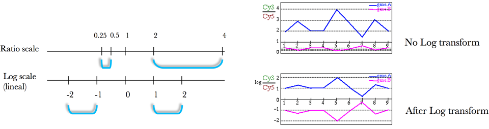
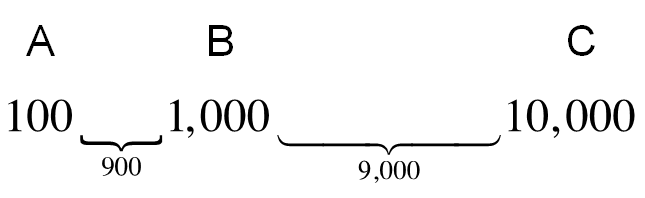
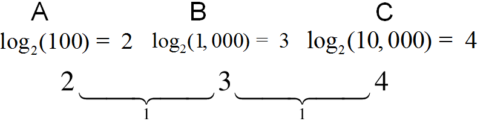
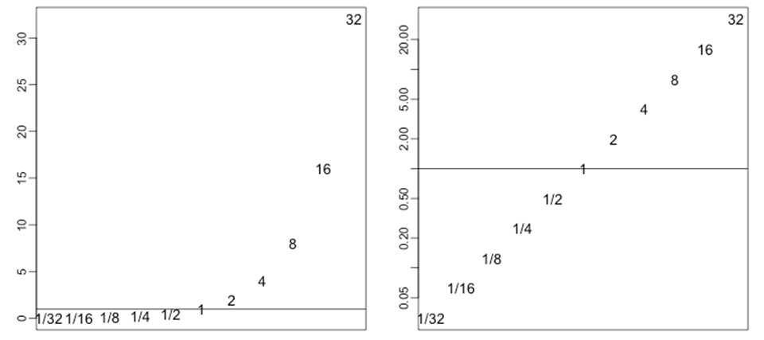

```{r setup, include=FALSE}
require(knitr)
hook_source_def = knit_hooks$get('source')
knit_hooks$set(source = function(x, options){
  if (!is.null(options$verbatim) && options$verbatim){
    opts = gsub(",\\s*verbatim\\s*=\\s*TRUE\\s*", "", options$params.src)
    bef = sprintf('\n\n    ```{r %s}\n', opts, "\n")
    stringr::str_c(bef, paste(knitr:::indent_block(x, "    "), collapse = '\n'), "\n    ```\n")
  } else {
     hook_source_def(x, options)
  }
})
```

## Expression Summaries: cDNA arrays {.larger}

- For custom spotted arrays, the quantity used for analysis is most often the 

$$log_2(\frac{SampleSignal}{ReferenceSignal})$$

- This ratio may or may not include background subtraction

$$log_2(\frac{SampleSignal-SampleBackground}{ReferenceSignal-ReferenceBackground})$$

## Problems with fold change {.larger}

- Fold changes, or ratios, can be larger than 1 (2-fold increase), or smaller than one (0.5). 
- Not symmetric around 1

<center>

</center>

## Why log2 {.larger}

- $log_2(\frac{x}{y}) = log_2(x)-log_2(y)$ - fold change converted to difference
- log ratios are symmetric around 0
- $log_2(1) = 0$
- $log_2(2) = 1$
- $log_2(0.5) = -1$


## log2 transformation {.larger}

<center>

</center>

| Condition | Fold change | Difference |
|:---------:|:-----------:|:----------:|
|  B vs. A  |      10     |     900    |
|  C vs. B  |      10     |    9000    |
|  C vs. A  |     100     |    9900    |

## log2 transformation {.larger}

<center>

</center>

- Note that on a log scale,
- The differences are 1.

## log2-transformation of raw intensities {.larger}

- The fold change distribution has a fat right tail
- The log2-transformed fold changes are linear

<center>

</center>
