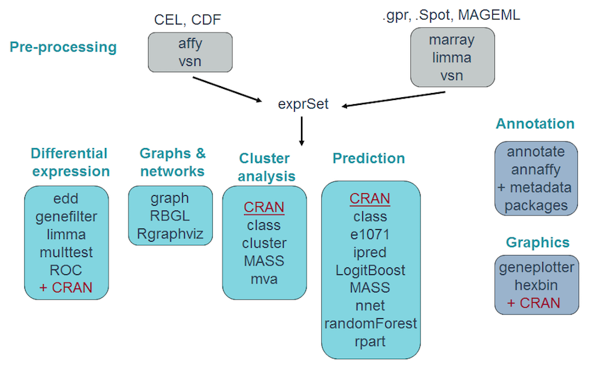
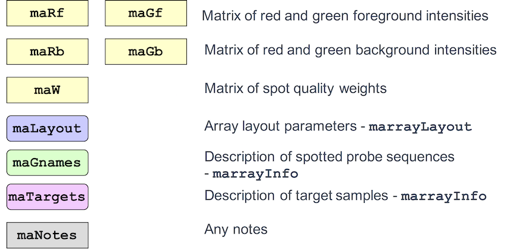
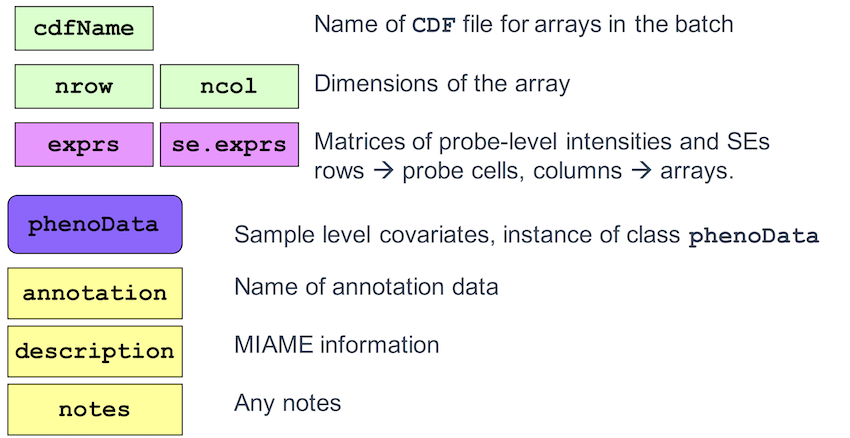
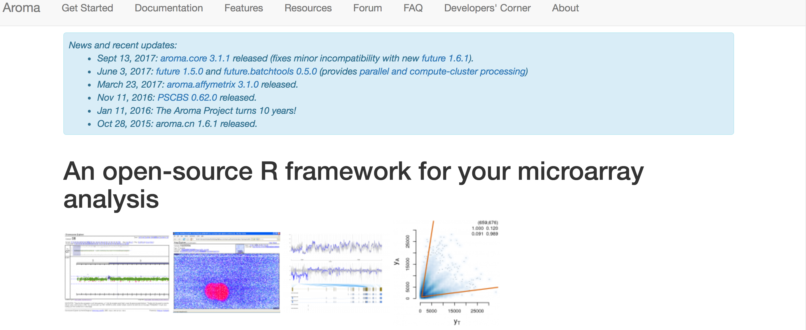

```{r setup, include=FALSE}
require(knitr)
hook_source_def = knit_hooks$get('source')
knit_hooks$set(source = function(x, options){
  if (!is.null(options$verbatim) && options$verbatim){
    opts = gsub(",\\s*verbatim\\s*=\\s*TRUE\\s*", "", options$params.src)
    bef = sprintf('\n\n    ```{r %s}\n', opts, "\n")
    stringr::str_c(bef, paste(knitr:::indent_block(x, "    "), collapse = '\n'), "\n    ```\n")
  } else {
     hook_source_def(x, options)
  }
})
```

## Bioconductor Project {.larger} 

- The Bioconductor project started in 2001

**Goal**: make it easier to conduct reproducible consistent analysis of data from new high-throughput biological technologies

- Core maintainers of the Bioconductor website located at Fred Hutchinson Cancer Research Center
- Updated version released biannually coinciding with the release of R
- Many contributed software packages

## Bioconductor packages {.larger}

- Bioconductor software consists of R add-on packages. 
- An R package is a structured collection of code (R, C, or other), documentation, and/or data for performing specific types of analyses. 
- E.g. **affy**, **limma**, **sva** packages provide implementations of specialized statistical and graphical methods.

## Goals of the Bioconductor Project {.larger}

- Provide access to statistical and graphical tools for analysis of high-dimensional biological data
1. Microarray analysis
2. High-throughput 'omics' data

## Goals of the Bioconductor Project {.larger}

- Include comprehensive **documentation** describing and providing examples for packages
- Packages have associated **vignettes** that provide examples of how to use functions
- Have additional tools to work with publically available databases and other meta-data

## Vignettes {.larger}

- Bioconductor has adopted a new documentation paradigm, the vignette.
- A vignette is an executable document consisting of a collection of documentation text and code chunks.
- Vignettes form dynamic, integrated, and reproducible statistical documents that can be automatically updated if either data or analyses are changed.
- Vignettes can be generated using the `sweave` function (or, `roxygen2` package)

## Microarray data analysis

<center>

</center>

## Microarray data analysis

<center>

</center>

## Bioconductor website {.larger}

Lets take a look at the website...

<http://bioconductor.org/>

## marrayRaw class {.larger}

Pre-normalization intensity data for a batch of arrays

<center>

</center>

## AffyBatch class {.larger}

Probe-level intensity data for a batch of arrays (same CDF)

<center>

</center>

## ExpressionSet class {.larger}

Processed Affymetrix or spotted array data

<center>

</center>

## MIAME {.larger}

Minimum Information About a Microarray Experiment (MIAME) <http://fged.org/projects/miame/>

The six most critical elements contributing towards MIAME are:

1 - The raw data for each hybridization (e.g., CEL or GPR files)

2 - The final processed (normalized) data for the set of hybridizations in the experiment (study) (e.g., the gene expression data matrix used to draw the conclusions from the study)

3 - The essential sample annotation including experimental factors and their values (e.g., compound and dose in a dose response experiment)

## MIAME {.larger}

Minimum Information About a Microarray Experiment (MIAME) <http://fged.org/projects/miame/>

4 - The experimental design including sample data relationships (e.g., which raw data file relates to which sample, which hybridizations are technical, which are biological replicates)

5 - Sufficient annotation of the array (e.g., gene identifiers, genomic coordinates, probe oligonucleotide sequences or reference commercial array catalog number)

6 - The essential laboratory and data processing protocols (e.g., what normalization method has been used to obtain the final processed data)

## Pre-processing packages {.larger}

1. `marray`: Spotted DNA microarrays.
2. `affy`: Affymetrix oligonucleotide chips.
3. `limma`: all, from spotted arrays to Affy to RNA-seq

- Reading in intensity data, diagnostic plots, normalization, computation of expression measures. 

- The packages start with very different data structures, but produce similar objects of class `ExpressionSet`.

- One can then use other Bioconductor and CRAN packages for exploratory data analysis and visualization, differential expression detection

## Pre-processing packages {.larger}

The aroma.affymetrix package is an R package for analyzing small to extremely large Affymetrix data sets. It allows you to analyze any number of arrays of various chip types, e.g. 10,000s of expression arrays, SNP chips, exon arrays and so on. Allows for alternative splicing analysis, copy number variations, among other options.

http://www.aroma-project.org/

<center></center>


