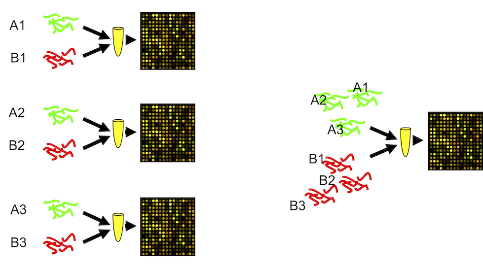
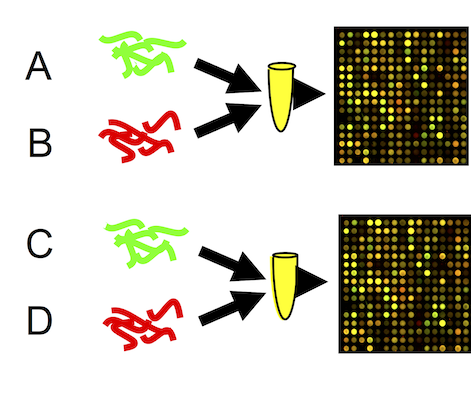
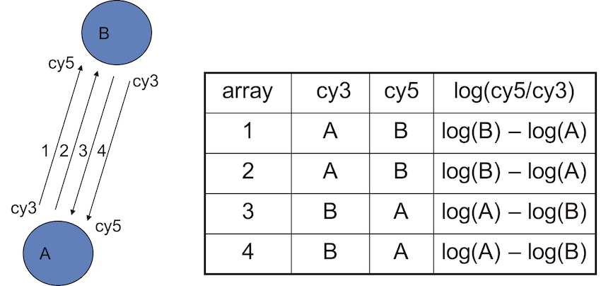
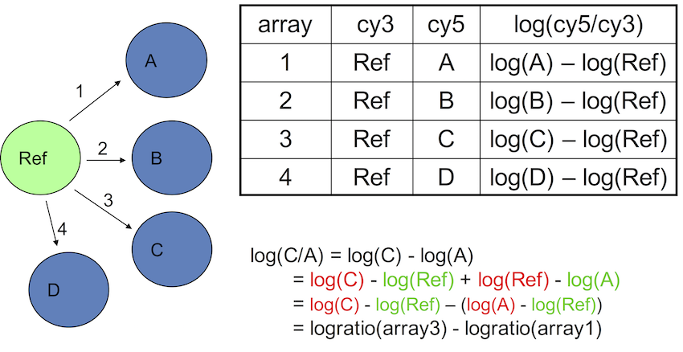
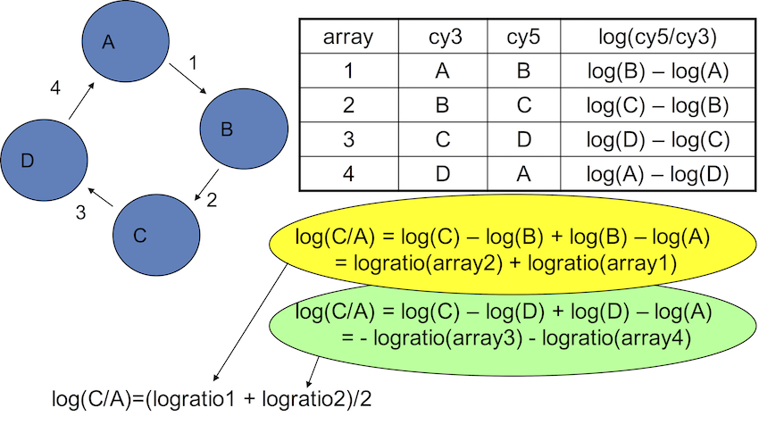
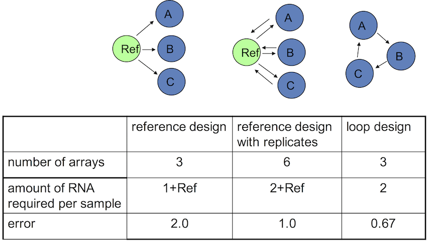
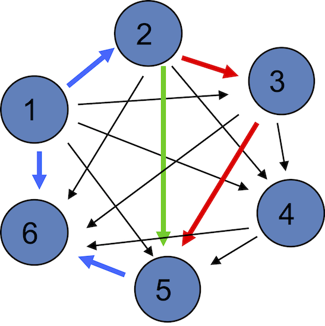

```{r setup, include=FALSE}
require(knitr)
hook_source_def = knit_hooks$get('source')
knit_hooks$set(source = function(x, options){
  if (!is.null(options$verbatim) && options$verbatim){
    opts = gsub(",\\s*verbatim\\s*=\\s*TRUE\\s*", "", options$params.src)
    bef = sprintf('\n\n    ```{r %s}\n', opts, "\n")
    stringr::str_c(bef, paste(knitr:::indent_block(x, "    "), collapse = '\n'), "\n    ```\n")
  } else {
     hook_source_def(x, options)
  }
})
```

## What is experimental design? {.larger}

The organization of an experiment, to ensure that _the right type of data_, and _enough of it_, is available to answer the questions of interest as clearly and efficiently as possible. 

## What characterizes well-designed experiments? {.larger}

- Effects can be estimated unambiguously and without bias.
- Estimates are precise.
- Protected from possible one-off events that might compromise the results.
- Easy to conduct.
- Easy to analyse and interpret.
- Maximum information obtained for fixed time, resources, and samples.
- Applicability of the findings to a wide variety of subjects, conditions, and situations.

## Why Design an Experiment?

- The goal of an experiment dictates everything from how the samples are collected to how the data are generated
- The design of the analytical protocol should be reflected in the design
    - Do we have enough replicates?
    - Do we have sufficient controls?
    - Do we collect samples and data to avoid confounding and batch effects?

## Types of Experiments {.larger}

**Class Comparison**  
- Can I find genes that distinguish between two classes, such as tumor and normal?

**Class Discovery**  
- Given what I think is a uniform group of samples, can I find subsets that are biologically meaningful?

**Classification**  
- Given a set of samples in different classes, can I assign a new, unknown sample to one of the classes?

**Large-scale Functional Studies**  
- Can I discover a causative mechanism associated with the distinction between classes? These are often not perfectly distinct.

## What affects the outcome of an experiment?

<center></center>

## What is bad Bad experimental design - examples

<center></center>

## What is bad Bad experimental design - examples

<center></center>

## What is bad Bad experimental design - examples

<center></center>

## What would be a better experimental design? {.larger}

- Process all samples at the same time/in one batch (not always feasible)
- Minimize confounding as much as possible through
    - blocking
    - randomization
- The batch effect will still be there, but with an appropriate design we can account for it

## Principles of experimental design {.larger}

- **Replication**. It allows the experimenter to obtain an estimate of the experimental error

>- **Randomization**. It requires the experimenter to use a random choice of every factor that is not of interest but might influence the outcome of the experiment. Such factors are called nuisance factors

>- **Blocking**. Creating homogeneous blocks of data in which a nuisance factor is kept constant while the factor of interest is allowed to vary. Used to increase the accuracy with which the influence of the various factors is assessed in a given experiment

>- **Block what you can, randomize what you cannot**

## Replicates {.larger}

<center>

</center>

- **Technical** replicates and **Biological** replicates 

>- Rule of thumb: for two-fold change – use 3 replicates

>- Smaller change – 5 replicates

## Randomization {.larger}

- Each gene has multiple probes – randomize their position on the slide

<center>

</center>

## Blocking {.larger}

- Treatment and RNA extraction days are confounded

<center>

</center>

## Blocking {.larger}

- Block replicated experiments

<center>

</center>

## Pooling

<center>

</center>

## Pooling {.larger}

- OK when the interest is not on the individual, but on common patterns across individuals (population characteristics)
- Results in averaging -> reduces variability -> substantive features are easier to find
- Recommended when fewer than 3 arrays are used in each condition
- Beneficial when many subjects are pooled

&nbsp;

**"inference for most genes was not affected by pooling"**

<div style="font-size: small;">
C. Kendziorski, R. A. Irizarry, K.-S. Chen, J. D. Haag, and M. N. Gould. "On the utility of pooling biological samples in microarray experiments". PNAS March 2005, 102(12) 4252-4257
</div>

## How to allocate the samples to microarrays?

- which samples should be hybridized on the same slide?
- how different experimental designs affect outcome?
- what is the optimal design?

<center>

</center>

## Example of four-array experiment | Dye swap

<center>

</center>

## Common reference design

<center>

</center>

## Loop design

<center>

</center>

## Comparing the designs

<center>

</center>

## Design with all direct pairwise comparisons

<center>

</center>

