```{r setup, include=FALSE}
require(knitr)
hook_source_def = knit_hooks$get('source')
knit_hooks$set(source = function(x, options){
  if (!is.null(options$verbatim) && options$verbatim){
    opts = gsub(",\\s*verbatim\\s*=\\s*TRUE\\s*", "", options$params.src)
    bef = sprintf('\n\n    ```{r %s}\n', opts, "\n")
    stringr::str_c(bef, paste(knitr:::indent_block(x, "    "), collapse = '\n'), "\n    ```\n")
  } else {
     hook_source_def(x, options)
  }
})
```

## Probe level QC {.larger}

Visual inspection of image file

- Any spot that comes in contact with a streak will be of unusually high intensity, making its value suspect. Flag and exclude such spots.

- Air bubbles and pockets prevent the sample from hybridizing, so that these regions will appear as dark regions on the image plot. Flag and exclude such spots.

- General haze – location based normalization may alleviate this problem.

## Visual defects

- Dimness/brightness, high background, high/low intensity spots, scratches, high
- Regional abnormalities, overall background, unevenness, spots, haze band, scratches, crop circle, cracks
- As long as these areas do not represent more than 10% of the total probes for the chip, then the area can be masked and the data points thrown out as outliers, or set as NAs.

<center>
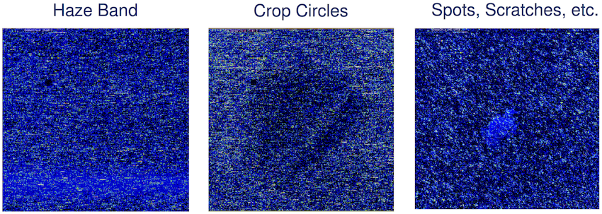
</center>

## Spatial biases | Images of probe level data

<center>
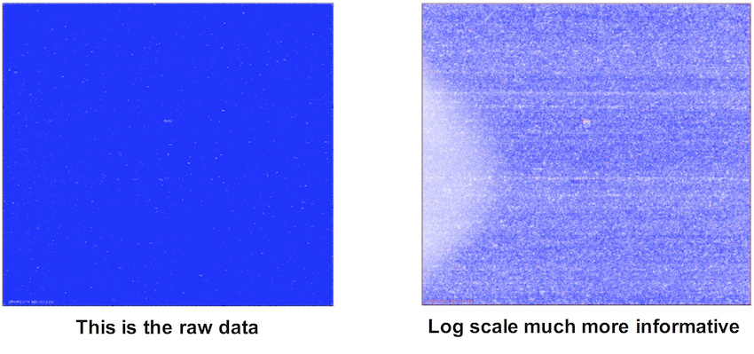
</center>

## Images of probe level data

<center>
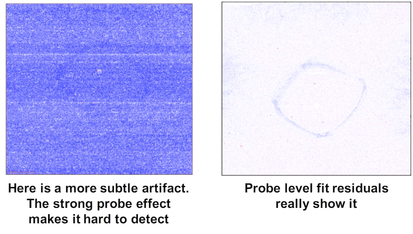
</center>

## Images of probe level data

<center>
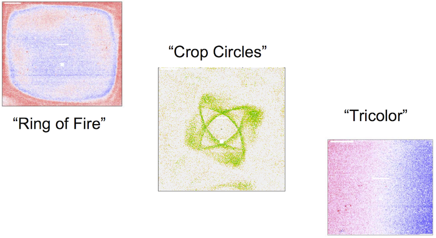
</center>

<http://plmimagegallery.bmbolstad.com/>

## Probe quality based on duplicate spots  {.larger}

- For arrays $j=1,…,J$, suppose there are various spots ($k1$ and $k2$) which interrogate the same gene $g$.
- Let $x_{gjk}$ represent the log ratio for gene $g$, spot $k$, on array $j$
- The _mean squared difference_ between the log ratios is
$$\frac{1}{J}\sum_{j=1}^J{(x_{gjk1}-x_{gjk2})^2}$$

>- A reasonable threshold would be to say that the multiple probes from the same gene disagree if this mean squared difference is greater than 1 on the log2 scale.

## Overall RNA quality control | RNA degradation plot

In Affymetrix arrays, a probe-set is dedicated to each target. A probe-set is composed by several probes (classically, 11), all targeting the mRNA target sequence. The RNA degradation plot proposes to plot the average intensity of each probes across all probe-sets, ordered from the 5’ to the 3’ end. 

<center>
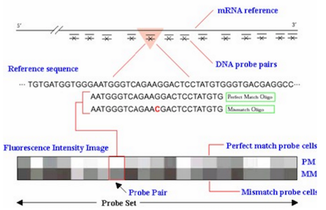
</center>

## Overall RNA quality control | RNA degradation plot

Since RNA degradation starts from the 5` end of the molecule, we would expect probe intensities to be globally lowered at that end of a probe set when compared to the 3’ end. The RNA degradation plot aims at visualizing this trend. 

<center>
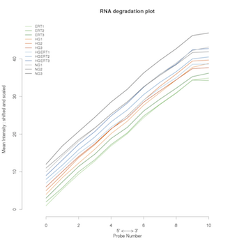
</center>

## Overall RNA quality control | RNA degradation plot

RNA which is too degraded will have a very high slope from 5' to 3'. The standardized slope of the curves is  used as a quantitative indicator of the RNA degradation. An array with unexpected degradation is identified because it has a bigger slope and should stand out.

<center>

</center>

## Overall RNA quality control | RNA degradation plot

- Because $\beta$-actin and GAPDH are expressed is most cell types and are relatively long genes, Affymetrix chips use them as controls of the RNA quality.
- Three probe-sets are designed on 3 regions of these genes (5', middle (called M) and 3' extremities).
- Similar intensities for their 3 regions indicate that the transcripts were not truncated and labeled equally along the sequence. 

For an array of good quality, Affymetrix recommends that the 3'/5' ratio should not exceed : 

- 3 for beta-actin 
- 1.25 for GAPDH 

## Present/Margin/Absent calls {.larger}

- **Percent present**: The present calls are defined with significant PM (perfect match) values regarding the MM (mismatch) values. The percentage of present calls should be similar for replicate arrays and within a range of 10% over the arrays

## Profiles and boxplots of all controls {.larger}

- Affymetrix arrays contain several control probesets, most of them annotated with the "AFFX" prefix. Oulier arrays may have different intensity profiles compared to other arrays.
- The probe calls AFFX-r2-Ec-bioB, bioC, and bioD are _E. coli_ genes that are used as internal hybridization controls and must always be present (P)
- The poly-A controls AFFX-r2-Bs-Dap, AFFX-r2-Bs-Thr, AFFXr2-Bs-Phe and AFFX-r2-Bs-Lys are modified _B. subtilis_
genes and should be called present at a decreasing intensity

<center>
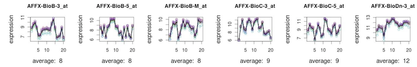
</center>

## Signal distribution: Scale factor {.larger}

- A main assumption behind most of the normalization methods for high-throughput expression arrays is that most of the genes are unchanged. 
- Affymetrix MAS5 algorithm applies a scale factor to each array in order to equalize their mean intensities.
- A dataset of arrays of good quality should not have very different scale factors.
- Affymetrix recommends that their scale factors should be within 3-fold of one another.

## Boxplots {.smaller}

<center>

</center>

The box plot can answer the following questions:

- Does signal distribution/variation differ between subgroups?
- Are there any outliers? 

## Boxplots of log-intensities {.larger}

The distributions of raw PM log-intensities are not expected to be identical but still not totally different while the distributions of normalized (and summarized) probe-set log-intensities are expected to be more comparable.

<center>

</center>

## Density histogram of log-intensities {.larger}

Density plots of log-intensity distribution of each array are superposed on a single graph for a better comparison between arrays and for an identification of arrays with weird distribution. The density distributions of raw PM log-intensities are not expected to be identical but still not totally different.

<center>
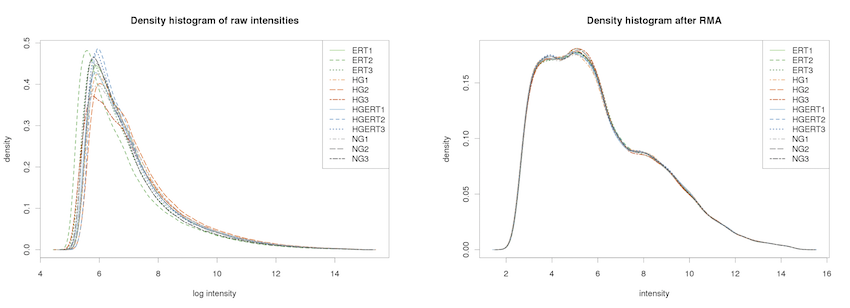
</center>

## QC from probe level model {.larger}

-   RMA fits a probe level model 
- Additive model, probe effect, array effect, error 
$$log_2y_{ij}=\mu_i+\alpha_j+\epsilon_{ij}$$
- Estimate $\mu$ gives RMA 
- Use M-estimators 
- To avoid showing the variability introduced by expression and probe effect we plot the residuals 
- We can also plot the weights used by the regression 
- Software available: `affyPLM` Bioconductor package (Ben Bolstad) 

## RLE

- The Relative Log Expression (RLE) values are computed by calculating for each probe-set the ratio between the expression of a probe-set and the median expression of this probe-set across all arrays of the experiment. 
- It is assumed that most probe-sets are not changed across the arrays, so it is expected that these ratios are around 0 on a log scale.

<center>
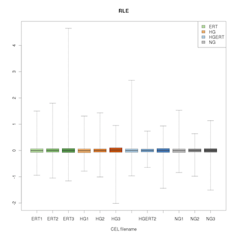
</center>

## NUSE

- The Normalized Unscaled Standard Error (NUSE) is the individual probe error fitting the Probe-Level Model (the PLM models expression measures using a M-estimator robust regression). 
- The NUSE values are standardized at the probe-set level across the arrays: median values for each probe-set are set to 1. 

<center>
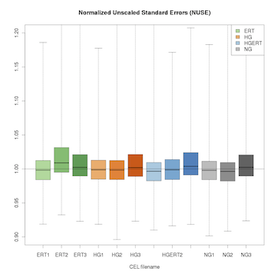
</center>

## RLE vs. NUSE

<center>
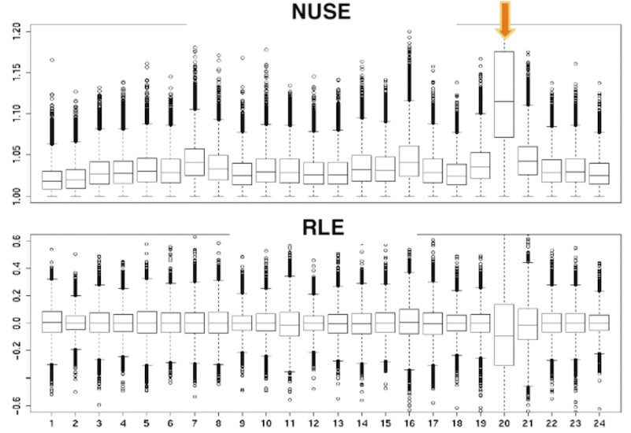
</center>

## Correlation between arrays {.larger}

- A correlation coefficient is computed for each pair of arrays in the dataset and is visualized as a heatmap.
- Best to do at each pre-processing step, e.g., before/after normalization

<center>

</center>

## Principal Components Analysis {.larger}

- Projects arrays onto a coordinate system that emphasizes variability among data

<center>

</center>

## Hierarchical clustering

The Hierarchical Clustering plot is computed in two steps: first it computes an expression measure distance between all pairs of arrays and then it creates the tree from these distances. 

<center>

</center>


