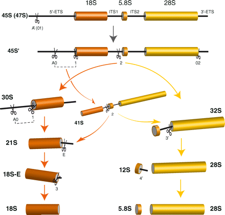
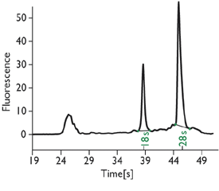
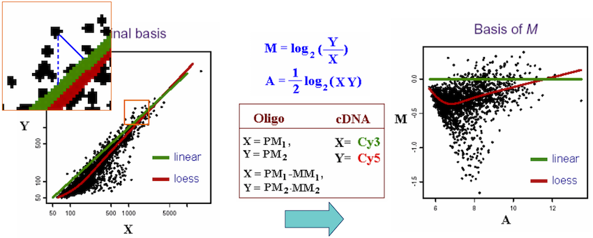

```{r setup, include=FALSE}
require(knitr)
hook_source_def = knit_hooks$get('source')
knit_hooks$set(source = function(x, options){
  if (!is.null(options$verbatim) && options$verbatim){
    opts = gsub(",\\s*verbatim\\s*=\\s*TRUE\\s*", "", options$params.src)
    bef = sprintf('\n\n    ```{r %s}\n', opts, "\n")
    stringr::str_c(bef, paste(knitr:::indent_block(x, "    "), collapse = '\n'), "\n    ```\n")
  } else {
     hook_source_def(x, options)
  }
})
```

## Importance of visualization {.larger}

**“The greatest value of a picture is when it forces us to notice what we never expected to see.”**

-- John Tukey

<center>

</center>

<div style="font-size: small;">
<http://www.ams.org/notices/200202/fea-tukey.pdf>
</div>

## RNA sample quality {.larger}

Should be done before any microarray/sequencing experiment

**RNA Purity**

- Absorbance, optical detection: 260:280 ratios and 260:270 ratios
- Pure RNA has 260:280 ratio is ~2.0
- Contaminations (protein, DNA, phenol) will affect absorbance ratios

## RNA sample quality {.larger}

- Capillary gel electrophoresis: 28S:18S ribosomal RNA ratio 
- Pure RNA has 28S:18S ratio >2

<center>

</center>

## RNA sample quality {.larger}

- Capillary gel electrophoresis: 28S:18S ribosomal RNA ratio 
- Pure RNA has 28S:18S ratio >2

<center>

</center>

## Levels of Quality Control {.larger}

- **Spot/Probe level**: poor quality of gene expression measurement on one particular array;

>- **Gene level**: poor quality of the expression measurement for a single gene across all arrays;

>- **Array level**: poor quality of all spots on a particular glass slide or GeneChip.

## Overview of quality measures {.larger}

- Number of spots excluded due to quality problems
- Number of saturated pixels
- Amount of normalization required
- Present/Absent calls for ribosomal RNAs 
- 3′:5′  Ratios
- 2D Spatial images
- Boxplots
- MA Plots 
- Linearity of signal intensities

## Spot Quality Measures {.larger}

Problematic spots should be flagged and omitted from subsequent analyses

- Spots with too many saturated pixels
- No hybridization
- Negative signal after background adjustment

## Intensity-dependent biases | Scatterplots and MA plots 

- Compare correlation between the expression values in the two conditions
- Identify genes that are differentially regulated between two conditions
- Drawbacks - Low-intensity values dominate

<center>

</center>

## Intensity-dependent biases | Scatterplots and MA plots {.larger}

- MA plots used to compare two microarrays (two vectors of intensities)
- MA plots show the dependence between average log2 intensity (x-axis) and ratio of the two intensities (y-axis)
- Better use of the plot's real estate - outliers in logarithm scale
spreads the data from the lower left corner to a more centered distribution in which the prosperities of the data are easy to analyze.
- Easier to describe the fold regulation of genes using a log scale. In log2 space, the data points are symmetric about 0.
