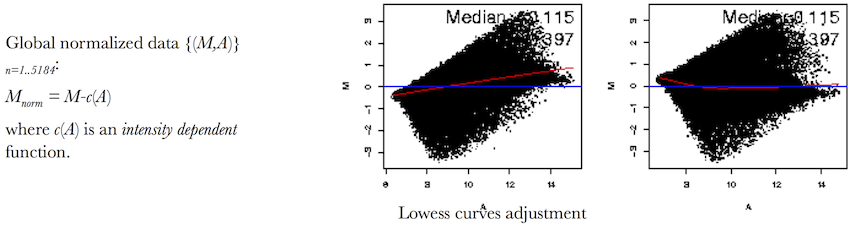
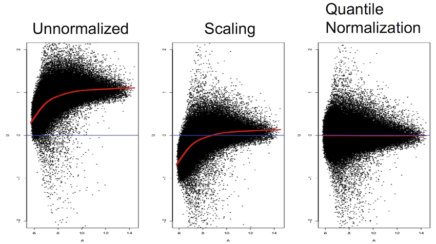
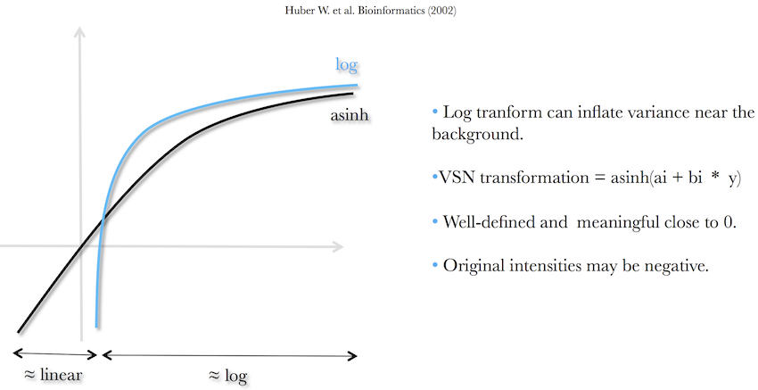

```{r setup, include=FALSE}
require(knitr)
hook_source_def = knit_hooks$get('source')
knit_hooks$set(source = function(x, options){
  if (!is.null(options$verbatim) && options$verbatim){
    opts = gsub(",\\s*verbatim\\s*=\\s*TRUE\\s*", "", options$params.src)
    bef = sprintf('\n\n    ```{r %s}\n', opts, "\n")
    stringr::str_c(bef, paste(knitr:::indent_block(x, "    "), collapse = '\n'), "\n    ```\n")
  } else {
     hook_source_def(x, options)
  }
})
```

## Biological vs. technical variability in gene expression {.larger}

- What is ultimately of interest in the use of gene expression microarrays is the measurement of **differences between experimental and reference states** or **between different groups** of experimental units. 

- Observed differences in microarray gene expression studies, however, are recognized as arising from two sources: 

    - **Biological variability** – changes in signal intensity driven by changes between biological states (healthy – disease)
    - **Technical variability** – non-biological sources of variability

## Sources of technical variability {.larger}

**Systematic**

- Amount of extracted RNA, efficiencies of RNA extraction, reverse transcription, labeling, photodetection, GC content of probes
- Similar non-bilological effect on many measurements

&nbsp;

- Corrections can be estimated from data and accounted for by normalization

## Sources of technical variability {.larger}

**Stochastic**

- PCR yield, DNA quality, spotting efficiency, spot size, non-specific hybridization, stray signal
- Noise components & "Schmutz" (dirt)

&nbsp;

- Too random to be explicitly accounted for – need to use error modeling

## Why normalization {.larger}

**Main idea**

- Remove the systematic bias in the data as completely as possible while preserving the variation in the gene expression that occurs because of biologically relevant changes in transcription.

&nbsp;
 
- The purpose of normalization is to adjust the gene expression values so that all genes on the array _that are not differentially expressed_ have similar values across all arrays.

## Goal of normalization {.larger}

**Assumption**

- The average gene does not change in its expression level in the biological sample being tested.
- Most genes are not differentially expressed
- Up- and down-regulated genes roughly cancel out the expression effect. 

## Two categories of normalization methods {.larger} 

**Baseline (reference) based methods**

- Use a reference set of selected genes (housekeeping, invariant, spike-ins), or a baseline array

**Complete (global, scaling) methods**

- Combine information from all arrays in a given dataset

## Reference set {.larger}

- **Housekeeping genes** - responsible for essential activities of cell maintenance & survival but not involved in cell function or proliferation. Such genes will be similarly expressed in all samples.

- **Control genes** - serve as artificial housekeeping gene set that should have equal expression across arrays or channels

## Reference set {.larger}

- **Invariant set** - genes that have the same rank across experiments. Empirically chosen

- **All genes** - appropriate when the majority of the genes are believed to be not differentially expressed

&nbsp;

>- **Problems** - defining reference sets may be biased. E.g., invariant set genes will be selected from the center of the distribution

## Within- and between array normalization {.larger}

**Intra-slide normalization (within array)**

- Applies to two-channel arrays
- Normalizes expression values to make intensities in two channels consistent within each array

**Inter-slide normalization (between array)**

- Normalizes expression values to achieve consistency between arrays
- Generally done after within-array normalization

## Normalization procedure {.larger}

The normalized signal intensity ratio for clone $k$ on array $j$ will be
$$x_{jk}=\log{\frac{R_{jk}}{G_{jk}}} - c_{jk}$$

Where

- $R_{jk}$ - the (background adjusted) Red signal
- $G_{jk}$ - the (background adjusted) Green signal
- $c_{jk}$ - the normalization factor

## Calculating $c_{jk}$ {.larger}

- Global normalization
- Intensity dependent normalization

    - Lo(w)ess 
    - Invariant set
    - Quantile

## Global normalization {.larger}

**$c_{jk}$ is the same for all genes on array $j$.**

Underlying assumptions

- Red & Green intensities have ~linear relationship through the origin;
- All cDNA species within a sample will incorporate an equivalent amount of dye per mole cDNA;
- There are no other variables that contribute to dye bias across slides.

## Calculating $c_{jk}$ {.larger}

A constant $c_j$ equal to the mean or median of the log ratios may be subtracted from all spots on array $j$. For example,

$$c_{jk}=c_j=median\left(log\frac{R_{jk}}{G_{jk}}\right)$$

for all clones/probes $k$ in $S$.

Alternatively, fit a linear regression and use the estimated slope parameter as the constant.

## Disadvantages of global normalization {.larger}

- Does not account for non-linearity of signal intensities. 

- Assumes cDNA from both dyes hybridized equally.

- More commonly, intensity dependent normalization methods are used.

## Intensity-dependent normalization {.larger}

Corrects intensities depending on the level of intensity, thereby changing the shape of the distribution of data

- Bland Altman (MA) plots
- Fitting a non-linear exponential curve
- LOWESS/LOESS regression

## Intensity dependent normalization {.larger}

- Here the correction is still

$$x_{jk}=\left(log\frac{R_{jk}}{G_{jk}}\right)-c_{jk}$$

but now $c_{jk}$ is the lowess fit, or $c_{jk}=f_j(A_{jk})$ where $f$ is some smoothing function fitted to array $j$ over all clones/probes $k$ in $S$.

- Robust locally weighted regression of intensity log-ratios $M_{jk}$ on the average log-intensity $A_{jk}$ overall (global lowess) can be used for intensity dependent normalization. 
- Other methods such as smoothing splines or exponential fits may also work well.

## Intensity-dependent normalization: LOWESS {.larger}

- LOcally WEighted Scatterplot Smoothing (Cleveland, 1979)

- First proposed for microarrays by Yang et al. (2002). Yang et al (2002) used local window of 40%.

- Global LOWESS use implicit assumptions that, when stratified by mRNA abundance, 

    * Only a minority of genes are expected to be differentially expressed or, 
    * Any differential expression is as likely to be up-regulation as well as down-regulation

## Intensity-dependent normalization: LOWESS {.larger}

- Loess normalization is based on MA plots.
- Skewing reflects experimental artifacts such as the contamination of one RNA source with genomic DNA or rRNA, the use of unequal amounts of fluorescent probes.

<center>

</center>

## Intensity-dependent normalization: LOWESS {.larger}

- Skewing can be corrected with local smoother: fitting a local regression curve to the data and subtracting the predicted value from the observed values
- Goal: minimize the standard deviation and place the mean log ratio at 0

<center>

</center>

## Print-tip lowess {.larger}

- LOWESS fits to the data within print-tip groups

- Sub-array normalization

## Affymetrix Method {.larger}

- **Scaling** (Affymetrix method, [sadd_whitepaper](http://media.affymetrix.com/support/technical/whitepapers/sadd_whitepaper.pdf)): First, choose a baseline GeneChip against which all other GeneChips are normalized.
- Calculate the 2% trimmed mean expression for the baseline GeneChip, represented by $\widetilde{x}_{base}$.
- Calculate the 2% trimmed mean expression for the $j^{th}$ GeneChip, represented by $\widetilde{x}_j$.
- The scaling factor is taken to be $\beta_j=\widetilde{x}_{base}/\widetilde{x}_j$, so that the scaled values on GeneChip $j$ are

$$x_{jk}^{scaled}=\beta_j*\widetilde{x}_{jk}$$

## Rank invariant set {.larger}

- Rather than using all genes for normalization, one may want to restrict the set of genes used for normalization by identifying those that are invariant.

- First, for each chip all genes are ranked; the invariant set is the set of genes with the same rank for each of the chips.

    - This is usually a very small number hence typically genes with approximately the same rank are used.

- Once the set of rank invariant genes is identified, intensity dependent normalization (fitting some smooth fit) is typically applied.

## Quantile normalization {.larger}

- Motivation from quantile-quantile plot

- Normal quantile-quantile plot consists of a plot of the ordered  values in your data versus the corresponding quantiles of a  standard normal distribution

- If the normal qqplot is fairly linear, your data are reasonably  Gaussian;  otherwise, they are  not.

## Between-array normalization methods {.larger}

- **Quantile normalization**: Make distribution of data equal across all samples. Final distribution is the average of each quantile across chips (Bolstad et.al., Bioinformatics (2003))

<center>

</center>

## Quantile normalization {.larger}

1. Given $n$ arrays of length $p$, form matrix $X$ of dimension $p × n$ where each array is a column.
2. Sort each column of $X$ to get $X_{sort}$. Remember to original order
3. Take the means across rows of $X_{sort}$ and replace the values of $X$ by those means. The resulting matrix is $X_{sort}'$.
4. Get $X_{normalized}$ by rearranging each column of $X_{sort}'$ to have the same ordering as original $X$.

Quantile normalization changes expression over many slides i.e. changes the correlation structure of the data, may affect subsequent analysis.

## Comparison of normalization techniques {.larger}

<center>

</center>

## Variance stabilizing normalization (VSN) {.larger}

<center>

</center>

Inverse hyperbolic sine function $ashin\ x\ = ln(x + \sqrt{1 + x^2})$. Has the compressing effect on large values like regular $ln\ x$, but has much less of a compressing effect for small values. Defined on the entire real number line, no need to add an offset like for regular log-transformation.

