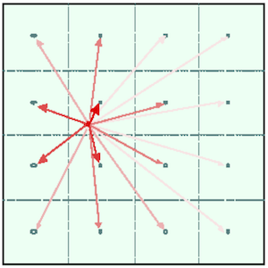
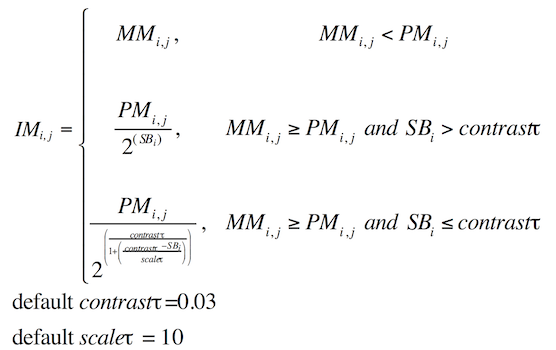
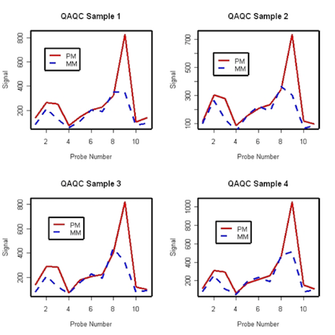

```{r setup, include=FALSE}
require(knitr)
hook_source_def = knit_hooks$get('source')
knit_hooks$set(source = function(x, options){
  if (!is.null(options$verbatim) && options$verbatim){
    opts = gsub(",\\s*verbatim\\s*=\\s*TRUE\\s*", "", options$params.src)
    bef = sprintf('\n\n    ```{r %s}\n', opts, "\n")
    stringr::str_c(bef, paste(knitr:::indent_block(x, "    "), collapse = '\n'), "\n    ```\n")
  } else {
     hook_source_def(x, options)
  }
})
```

## Expression Quantification: Affy

Affymetrix Genechip is an oligonucleotide array consisting of a several perfect match (PM) and their corresponding mismatch (MM) probes that interrogate for a single gene. 

- PM is the exact complementary sequence of the target genetic sequence, composed of 25 base pairs 
- MM probe, which has the same sequence with exception that the middle base (13th) position has been reversed 
- There are roughly 11-20 PM/MM probe pairs that interrogate for each gene, called a probe set 

## Affymetrix Expression Array Preprocessing

**Background adjustment**

Remove intensity contributions from optical noise and cross-hybridization

- so the true measurements aren't affected by neighboring measurements

1. PM-MM 
2. PM only 
3. RMA 
4. GC-RMA

## Affymetrix Expression Array Preprocessing

**Normalization**

Remove array effect, make array comparable

1. Constant or linear (MAS)
2. Rank invariant (dChip)
3. Quantile (RMA)

## Affymetrix Expression Array Preprocessing

**Summarization**

Combine probe intensities into one measure per gene

1. MAS 4.0, MAS 5.0
2. Li-Wong (dChip)
3. RMA

## Expression Index estimates

**Summarization**

- Reduce the 11-20 probe intensities on each array to a single number for gene expression.
- The goal is to produce a measure that will serve as an indicator of the level of expression of a transcript using the PM (and possibly MM values).

## Expression Index estimates

**Single Chip**

- MAS 4.0 (avgDiff): no longer recommended for use due to many flaws.
- MAS 5.0: use One-Step Tukey biweight to combine the probe intensities in log scale average $log_2(PM - BG)$

## Expression Index estimates

**Multiple Chip**

- **MBEI** (Li-Wong): a multiplicative model (Model based expression index)
- **RMA** (Irizarry): a robust multi-chip linear model fit on the log scale (Robust Multi-array Average)

## Expression Quantification: Affy

Initially, Affymetrix signal was calculated as

$$AvgDiff=\frac{1}{A}\sum_{j \in A}{(PM_j - MM_j)}$$

where $j$ indexes the probe pairs in the set $A$, where the set $A$ excludes the max and min differences. This is known as the “Average Difference” method (MAS 4.0).

## Expression Quantification: Affy

Initially, Affymetrix signal was calculated as

$$AvgDiff=\frac{1}{A}\sum_{j \in A}{(PM_j - MM_j)}$$

**Problems**

- Large variability in PM-MM  
- MM probes may be measuring signal for another gene/EST
- PM-MM may be negative => no log scale

## Approach #1: MAS5

- MAS5 was an attempt to develop a "standard" technique for 3’ expression arrays
- The flaws of MAS5 led to an influx of research in this area.
- The algorithm is best-described in an Affymetrix white-paper (sadd_whitepaper.pdf)[http://www.affymetrix.com/support/technical/whitepapers/sadd_whitepaper.pdf], and is actually quite challenging to reproduce exactly in R. 

## MAS 5.0 Method

Steps for obtaining Affymetrix Microarray Suite 5.0 expression measures 

- Adjust cell intensities for background.
- Adjust PM values by subtracting an Ideal Mismatch (IM).  
- Take log2 transformation.
- Calculate a robust mean of the PM values for a probe set using Tukey’s biweight estimator to estimate the Signal. 
- Apply a scaling factor to the Signal values from previous step. 

## MAS5: Background & Noise

**Background**

- Divide chip into zones
<center>

</center>

## MAS5: Background & Noise {.smaller}

**Background**

- Divide chip into zones
- Select lowest 2% intensity values. This is zone background $b$ for the zone $bZ_k$
- stdev of those values is zone variability
- Background at any location is the sum of all zones background, weighted by $w_k(x,y)=1/(d_k^2(x,y) + fudge \, factor)$
- The background $b$ for cell $x,y$ is:

$$b(x,y) = \frac{1}{\sum_{k=1}^K{w_k(x,y)}}\sum_{k=1}^Kw_k(x,y)*bZ_k$$


## MAS5: Background & Noise

**Noise**

- Using same zones as above
- Select lowest 2% background
- stdev of those values is zone noise $nZ_k$
- Noise at any location is the sum of all zone noise as above. Just substitute $n(x,y)$ for $b(x,y)$, and $nZ_k$ for $bZ_k$


## MAS5: Background adjusted intensity

$A(x,y)=max(I'(x,y)) - b(x,y), \, NoiseFrac*n(x,y))$ where $I'(x,y)=max(I'(x,y),0.5)$

$A$ - adjusted intensity = intensity minus background, the final value should be > noise

$I$ - measured intensity

$b$ - background

$n$ - noise

$NoiseFrac$ - another fudge factor = 0.5

## MAS5: Ideal Mismatch

Because sometimes $MM > PM$, we need _Idealized Mismatch_

First, calculate a specific background ratio using the Tukey biweight

$$SB_i=T_{bi}(log_2(PM_{i,j}-log_2(mm_{i,j})):j=1, ..., n_i)$$

<center>

</center>

## MAS5: Signal

Value for each probe: $V_{i,j}=max(PM_{i,j}-IM_{i,j},\delta) \; default \, \delta = 2^{-20}$

Probe value: $PV_{i,j}=log_2(V_{i,j}),j=1, ..., n_i$

Modified mean of probe values: $SignalLogValue_i=T_{bi}(PV_{i,1}, ..., PV_{i,n_i})$

Scaling factor (default $Sc=500$): $sf=\frac{Sc}{TrimMean(2^{SignalLogValue_i},0.02,0.98)}$

Final signal (default $nf=1$): $ReportedValue(i)=nf*sf*2^{SignalLogValue_i}$

## MBEI: Modeling probe effect

Li and Wong’s observations

- There is a large probe effect
- There are outliers that are only noticed when looking across arrays
- Non-linear normalization needed

"Model-based analysis of oligonucleotide arrays: Expression index computation and outlier detection" PNAS 2001 http://www.pnas.org/content/98/1/31.long

## MBEI: Modeling probe effect

<center>

</center>

## MBEI Expression Summaries

Li and Wong (2001) proposed a model-based expression index (MBEI) expression measures 

For a set of arrays $i=1,..., I$, for each probe set comprised of probe pairs $j=1,.., J$, the PM and MM intensities for the $i^{th}$ and $j^{th}$ probe pair are modeled as

$PM_{ij}=v_j + \alpha_j \theta_i + \phi_j \theta_i + \epsilon$

$MM_{ij}=v_j + \alpha_j \theta_i + \epsilon$

$y_{ij}=PM_{ij} - MM_{ij}=\phi_j \theta_i + \epsilon$

## MBEI Expression Summaries

$PM_{ij}=v_j + \alpha_j \theta_i + \phi_j \theta_i + \epsilon$

$MM_{ij}=v_j + \alpha_j \theta_i + \epsilon$

$y_{ij}=PM_{ij} - MM_{ij}=\phi_j \theta_i + \epsilon$

- $\theta_i$ is the model based expression index (MBEI) for the $i^{th}$ array
- $v_j$ is the mean intensity of the $j^{th}$ probe pair due to non-specific hybridization
- $\alpha_j$ is the rate of increase of MM response of the $j^{th}$ MM probe (non-specific effect)
- $\phi_j$ is the additional rate of increase in the PM response of the jth PM probe (specific effect)
- The errors $\epsilon$ are assumed independent normally distributed with variance $\sigma^2$.

## MBEI Expression Summaries

$IxJ$ equations

$I \; \theta_i$ array parameters, $J \; \phi_j$ gene parameters, $I+J$ all parameters

Assume $\phi_j$ is known, use them to find best $\theta_i$. Then, use $\theta_i$ estimates to estimate $\phi_j$

Iterative least square procedure

Estimate $\theta_i$ is the expression index

## What is RMA?

RMA = Robust Multi-Array

Why do we use a “robust” method?

- Robust summaries really improve over the standard ones by down weighing outliers and leaving their effects visible in residuals. 

Why do we use “array”?

- To put each chip’s values in the context of a set of similar values on other arrays

## What is RMA?

- It is a log scale linear additive model
- Assumes all the chips have the same background distribution
- Does not use the mismatch probe (MM) data from the microarray experiments - why?

## What is RMA?

- Mismatch probes (MM) definitely have information - about both signal and noise - but using it without adding more noise is a challenge
- We should be able to improve the background correction using MM, without having the noise level blow up: topic of current research (GCRMA)
- Ignoring MM decreases accuracy but increases precision

## RMA

Steps for obtaining Robust Multi-Array Average Expression 

- Adjust for background on a raw intensity scale using PM/MM data from *.CEL files.
- $PM_{ijg}=sg_{ijg}+bg_{ijg}$. 
- True signal follows exponential distribution $sg_{ijg} \approx Exp(\lambda_{ijg})$
- The background follows normal distribution $bg_{ijg} \approx N(\beta, \sigma_i^2)$
- True signal and background are independent

## RMA

Steps for obtaining Robust Multi-Array Average Expression

- Adjust for background on a raw intensity scale using PM/MM data from *.CEL files.
- Carry out quantile normalization using the PM – bg adjusted values. 
- Take $log_2$ of the normalized background corrected PMs
- $PM_{ijg}=sg_{ijg}+bg_{ijg}$. 
- For each probe set $g$, fit the model where $i$ is the array effect and $j$ is the probe effect. 

## RMA

$$log_2(background \, corrected \, PM_{ij}) = \mu + \alpha_i + \beta_j + \epsilon_{ij}$$

$\mu + \alpha_i$ is the $log_2$ expression for array $i=1, ..., I$

$\beta_j$ is the $log_2$ affinity effect for probes $j=1,...,J$

$\epsilon_{ij}$ is the error term

The estimate of $\mu + \alpha_i$ gives the expression measures for a probe set $n$ on array $i$.

A robust estimation procedure (median polish) is used to estimate the parameters in order to protect against outlier probes.

## Tukey's median polish

Array i - rows

Probe j - columns

$$log_2(background \, corrected \, PM_{ij}) = \mu + \alpha_i + \beta_j + \epsilon_{ij}$$

$\alpha_i$ - row (array) effect

$\beta_j$ - column (probe) effect

Alternately subtract row and column medians until sum of absolute residuals converges.

We are interested in the fitted (predicted) row values $\hat{\mu_i}=\hat{\mu}+\hat{\sigma_i}$

## RMA procedure

The parameters in the above equations are unidentifiable. Need constraint $\sum{\alpha_j}=0$ - initial row effect

Perform Tukey’s Median Polish on the matrix of $y_{ij}$ values in the $i^{th}$ row and $j^{th}$ column. 

Basically, it entails iteratively normalizing row and column medians to 0 until convergence. 

## RMA procedure

Let $\hat{y_{ij}}$ denote the fitted value for $y_{ij}$ that results from the median polish procedure

Let $\hat{\alpha_j}=\hat{y_{.j}}-\hat{y_{..}}$, where $\hat{y_{.j}}=\sum_i{\frac{y_{ij}}{I}}$, and $\hat{y_{..}}=\sum_i{\sum_j{\frac{y_{ij}}{I*J}}}$, where $I,J$ - number of arrays and probes

Let $\hat{\beta_i}=\sum_j{\frac{y_{ij}}{J}}$

Then, $\hat{\beta_i}$ are the RMA measures of expression for array $i$.

## RMA flavor

**Original RMA**: Irizarry et.al. (Nucleic Acids Research, 2003; Biostatistics, 2003) http://biostatistics.oxfordjournals.org/content/4/2/249.long

**GC-RMA**: Wu et.al. (J. Amer. Stat. Assoc., 2004), apply cross-hybridization correction that depends on G-C content of probe http://www.tandfonline.com/doi/abs/10.1198/016214504000000683

**Frozen robust multiarray analysis (fRMA)**. McCall MN, Bolstad BM, Irizarry RA Biostatistics. 2010 http://biostatistics.oxfordjournals.org/content/11/2/242.long

## GCRMA

- Similar to RMA, but calculates background differently
- Makes use of MM intensities to correct background
- Background more directly addresses nonspecific binding (appears to be sequence dependent)
- Not necessarily better than RMA

## Normalization: final touches

- Reduces systematic (not random) effects; makes it possible to compare several arrays
- There are many variations and extensions of the normalization methods. It’s a highly opinionated field.
- Normalization affects the final analysis, but not often clear which strategy is the best; normalization may introduces more variability
- Normalization can improve the quality of analysis, remove technical effects
- Nothing can rescue bad quality data

## Normalization: final touches

Preprocessing involves three main steps:

- Background / Normalization / Summarization
- Almost all preprocessing methods return expression levels on log2 scale

RMA (performs well overall)

- Background Correction
- Quantile Normalization
- Summarization using Median Polish


