## Overview {.larger}

- Why enrichment analysis?
- What is enrichment analysis?
- Gene ontology and pathways
- GENE ontology and pathways enrichment
- Tools and references

## Overview {.larger}

- **Why enrichment analysis?**
- 
What is enrichment analysis?

- 
Gene ontology and pathways

- 
GENE ontology and pathways enrichment

- 
GENOMIC REGIONS enrichment

- 
Tools and references

## Why enrichment analysis?  {.larger}

- Human genome contains ~20,000-25,000 genes
- Each gene has multiple functions
- If 1,000 genes have changed in an experimental condition, it may be difficult to understand what they do

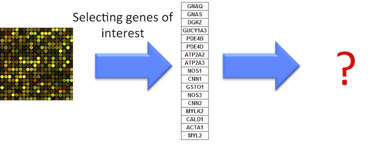

## Birds of a feather flock together {.larger}

- Genes with similar expression patterns share similar functions
- Similar (common) functions characterize a group of genes

## Birds of a feather flock together {.larger}

- Genes with similar expression patterns share similar functions
- Similar (common) functions characterize a group of genes

&nbsp;

- People with similar genetic patterns are likely friends

- Christakis NA, Fowler JH. "Friendship and natural selection." PNAS 2014 [https://www.ncbi.nlm.nih.gov/pubmed/25024208](https://www.ncbi.nlm.nih.gov/pubmed/25024208)

## Why enrichment analysis?  {.larger}

- High level understanding of the biology behind gene expression – **Interpretation!**
- Translating changes of hundreds/thousands of differentially expressed genes into a few biological processes (reducing dimensionality)

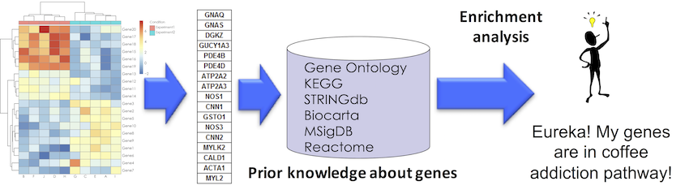

## Overview {.larger}

- 
Why enrichment analysis?

- **What is enrichment analysis?**
- 
Gene ontology and pathways

- 
Enrichment analysis

- 
GENE ontology and pathways enrichment

- 
Tools and references

## What is enrichment analysis {.larger}

- **Enrichment analysis** - summarizing common functions associated with a group of objects

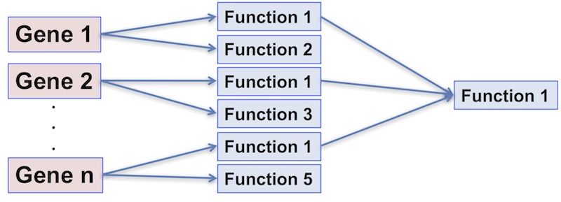

## What is enrichment analysis? – statistical definition {.larger}

**Enrichment analysis** – detection whether a group of objects has certain properties more (or less) frequent than can be expected by chance

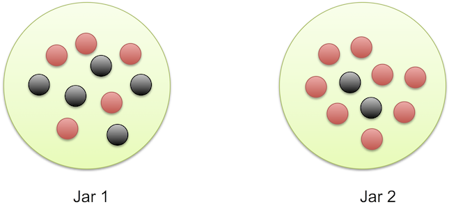

## Classification of genes {.larger}

**Gene set** - _a priori_ classification of genes into biologically relevant groups (sets)

- Members of the same biochemical pathways
- Genes annotated with the same molecular function
- Transcripts expressed in the same cellular compartments
- Co-regulated/co-expressed genes
- Genes located on the same cytogenetic band
- ...

## Overview {.larger}

- 
Why enrichment analysis?

- 
What is enrichment analysis?

- **Gene ontology and pathways**
- 
GENE ontology and pathways enrichment

- 
Tools and references

## Annotation databases and ontologies

- An annotation database annotates genes with functions or properties - sets of genes with shared functions
- Structured prior knowledge about genes

## Gene ontology {.larger}

- An ontology is a formal (hierarchical) representation of concepts and the relationships between them.

- The objective of GO is to provide controlled vocabularies of terms for the description of gene products.

- These terms are to be used as attributes of gene products, facilitating uniform queries across them.

## Gene ontology hierarchy {.larger}

- Terms are related within a hierarchy using "is-a", "part-of" and other connectors

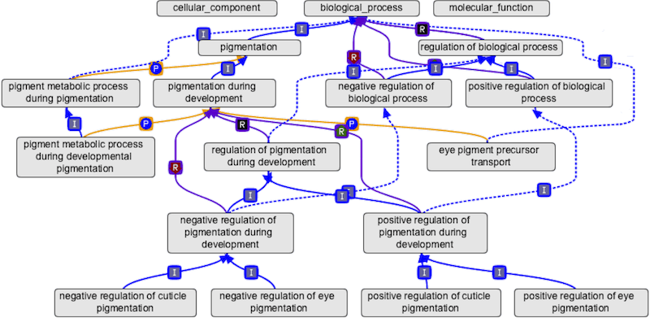

## Gene ontology structure {.larger}

Gene ontology describes multiple levels of detail of gene function.

- **Molecular Function** - the tasks performed by individual gene products; examples are _transcription factor_ and _DNA helicase_ 

>- **Biological Process** - broad biological goals, such as _mitosis_ or _purine metabolism_, that are accomplished by ordered assemblies of molecular functions 

>- **Cellular Component** - subcellular structures, locations, and macromolecular complexes; examples include _nucleus_, _telomere_, and _origin recognition complex_

## Gene ontology database

<http://geneontology.org/>

<https://www.ebi.ac.uk/QuickGO/>

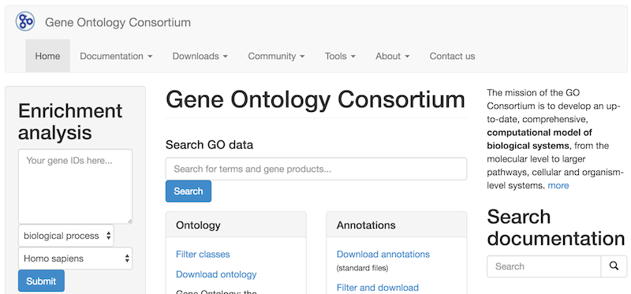

## Gene ontologies are not created equal

- Different levels of evidence: 

    - Experimental
    - Computational analysis
    - Author Statement
    - Curator Statement
    - Inferred from electronic annotation

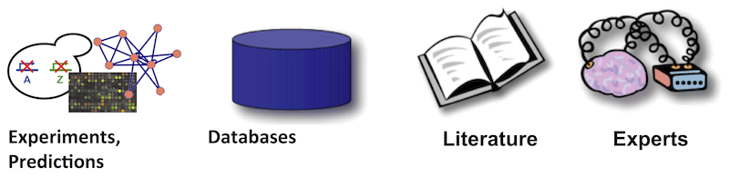

<http://geneontology.org/page/evidence-code-decision-tree>

## Gene ontologies are not created equal

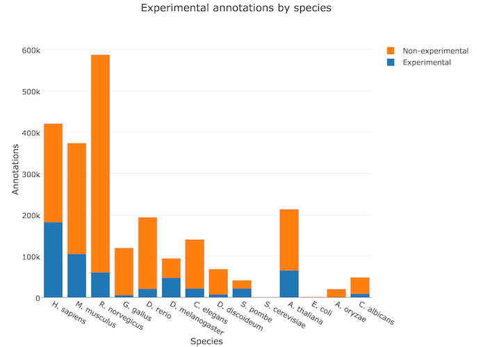

<http://amigo.geneontology.org/amigo/base_statistics>

## User-friendly Gene Ontology annotations

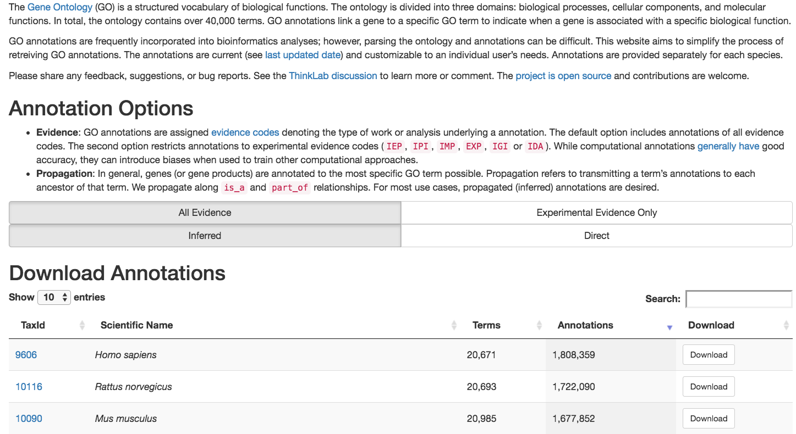

http://git.dhimmel.com/gene-ontology/

## Gene ontologies for model organisms {.smaller}

- **Mouse Genome Database** (MGD) and Gene Expression Database (GXD) (Mus musculus) <http://www.informatics.jax.org/>
- **Rat Genome Database** (RGD) (Rattus norvegicus) <http://rgd.mcw.edu/>
- **FlyBase** (Drosophila melanogaster) <http://flybase.org/>
- **Berkeley Drosophila Genome Project** (BDGP) <http://www.fruitfly.org/>
- **WormBase** (Caenorhabditis elegans) <http://www.wormbase.org/>
- **Zebrafish Information Network** (ZFIN) (Danio rerio)  <http://zfin.org/>
- **Saccharomyces Genome Database** (SGD) (Saccharomyces cerevisiae) <http://www.yeastgenome.org/>
- **The Arabidopsis Information Resource** (TAIR) (Arabidopsis thaliana) <https://www.arabidopsis.org/>
- **Gramene** (grains, including rice, Oryza) <http://www.gramene.org/>
- **dictyBase** (Dictyostelium discoideum)  <http://dictybase.org/>
- **GeneDB** (Schizosaccharomyces pombe, Plasmodium falciparum, Leishmania major and Trypanosoma brucei) <http://www.genedb.org/>

## MSigDb - Molecular Signatures Database

<http://software.broadinstitute.org/gsea/msigdb/>

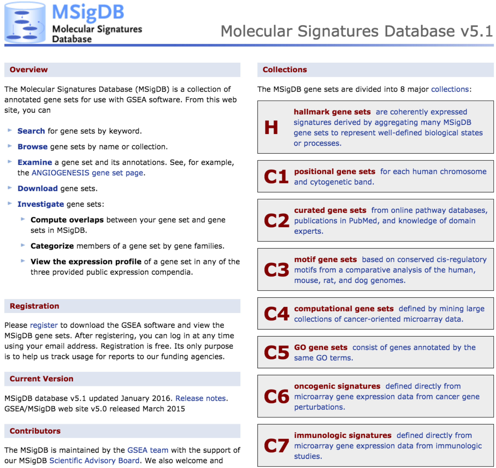

## MSigDb - Molecular Signatures Database

<https://github.com/stephenturner/msigdf>

- **H**, **hallmark gene sets** are coherently expressed signatures derived by aggregating many MSigDB gene sets to represent well-defined biological states or processes.
- **C1**, **positional gene sets** for each human chromosome and cytogenetic band.
- **C2**, **curated gene sets** from online pathway databases, publications in PubMed, and knowledge of domain experts.
- **C3**, **motif gene sets**  based on conserved _cis_-regulatory motifs from a comparative analysis of the human, mouse, rat, and dog genomes.
- **C4**, **computational gene sets** defined by mining large collections of cancer-oriented microarray data.
- **C5**, **GO gene sets**  consist of genes annotated by the same GO terms.
- **C6**, **oncogenic signatures** defined directly from microarray gene expression data from cancer gene perturbations.
- **C7**, **immunologic signatures** defined directly from microarray gene expression data from immunologic studies.

## Pathways

- An ordered series of molecular events that leads to the creation new molecular product, or a change in a cellular state or process. 
- Genes often participate in multiple pathways – think about genes having multiple functions

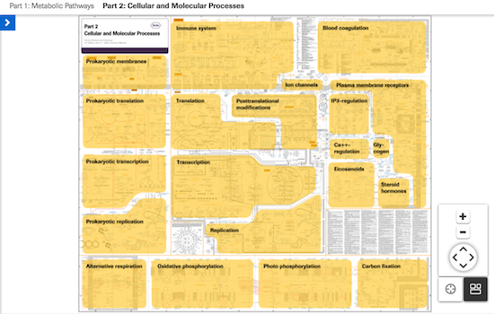

<http://biochemical-pathways.com/#/map/1>

## KEGG pathway database {.larger} 

- **KEGG: Kyoto Encyclopedia of Genes and Genomes** is a collection of biological information compiled from published material = curated database. 
- Includes information on genes, proteins, metabolic pathways, molecular interactions, and biochemical reactions associated with specific organisms
- Provides a relationship (map) for how these components are organized in a cellular structure or reaction pathway. 

<http://www.genome.jp/kegg/>

## KEGG pathway diagram

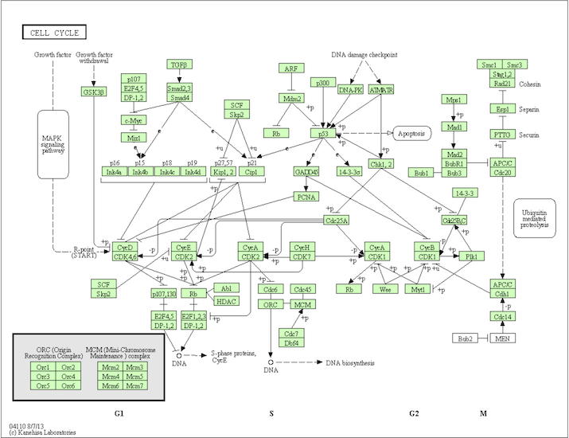

## Reactome {.larger}

- Curated human pathways encompassing metabolism, signaling, and other biological processes.
- Every pathway is traceable to primary literature.

<http://www.reactome.org/>

## Reactome pathway diagram

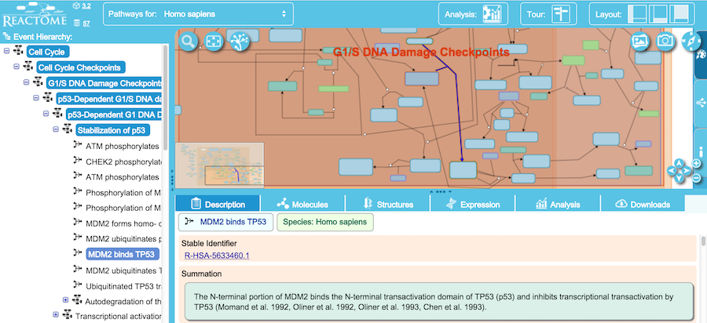

## Other pathway databases {.larger}

- **PathwayCommons**, version 8 has over 42,000 pathways from 22 data sources, http://www.pathwaycommons.org/
- **PathGuide**, lists ~550 pathway related databases, http://www.pathguide.org/
- **WikiPathways**, community-curated pathways, http://wikipathways.org/
- **BioCarta**, pathway genes and diagrams, https://cgap.nci.nih.gov/Pathways/BioCarta_Pathways
- **Consensus-PathDB**, pathway interactions, enrichment, data, http://www.consensuspathdb.org/

## Genes to networks

- **GeneMania**, networks based on different properties, http://genemania.org
- **STRING**, protein-protein interaction networks, http://string-db.org
- **Genes2Networks**, protein-protein interaction networks, http://amp.pharm.mssm.edu/X2K/#g2n
- **IntAct**, protein-protein interaction data and networks, https://www.ebi.ac.uk/intact/
- **HPRD**, protein-protein interaction database, http://www.hprd.org/

## Overview {.larger}

- 
Why enrichment analysis?

- 
What is enrichment analysis?

- 
Gene ontology and pathways

- **GENE ontology and pathways enrichment**
- 
Tools and references

## Enrichment analysis | Null hypothesis {.larger}

- **Self-contained $H_0$**: genes in the gene set do not have any association with the pheontype

- Problem: restrictive, use information only from a gene set
                  

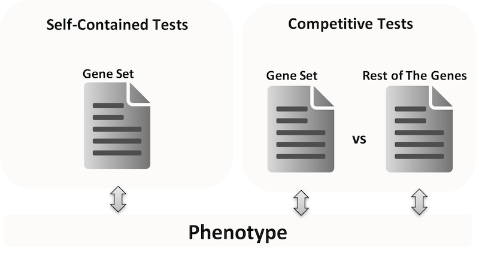

## Enrichment analysis | Null hypothesis {.larger}

- **Competitive $H_0$**: genes in the gene set have the same level of association with a given phenotype as genes in the complement gene set

- Problem: wrong assumption of independent gene sampling

## Approach 1 {.larger}

**Overrepresentation analysis, Hypergeometric test** 

- $m$ is the total number of genes
- $j$ is the number of genes are in the functional category
- $n$ is the number of differentially expressed genes
- $k$ is the number of differentially expressed genes in the category

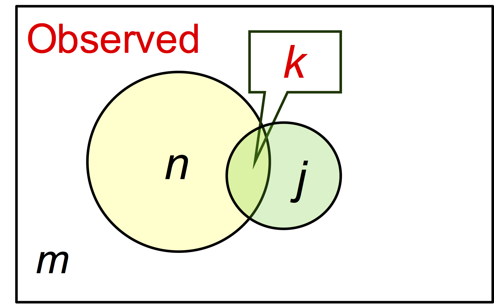

## Approach 1 {.larger}

**Overrepresentation analysis, Hypergeometric test** 

- $m$ is the total number of genes
- $j$ is the number of genes are in the functional category
- $n$ is the number of differentially expressed genes
- $k$ is the number of differentially expressed genes in the category

The expected value of $k$ would be $k_e=(n/m)*j$. 

If $k > k_e$, functional category is said to be enriched, with a ratio of enrichment $r=k/k_e$

## Approach 1 {.larger}

**Overrepresentation analysis, Hypergeometric test** 

- $m$ is the total number of genes
- $j$ is the number of genes are in the functional category
- $n$ is the number of differentially expressed genes
- $k$ is the number of differentially expressed genes in the category

|                    | Diff. exp. genes | Not Diff. exp. genes | Total |
|--------------------|:----------------:|:--------------------:|:------|
| In gene set        |        k         |           j-k        | j     |
| Not in gene set    |       n-k        |         m-n-j+k      | m-j   |
| Total              |       n          |           m-n        |  m    |

## Approach 1 {.larger}

**Overrepresentation analysis, Hypergeometric test** 

- $m$ is the total number of genes
- $j$ is the number of genes are in the functional category
- $n$ is the number of differentially expressed genes
- $k$ is the number of differentially expressed genes in the category

What is the probability of having $k$ or more genes from the category in the selected $n$ genes?

$$P = \sum_{i=k}^n{\frac{\binom{m-j}{n-i}\binom{j}{i}}{{m \choose n}}}$$

## Approach 1 {.larger}

**Overrepresentation analysis, Hypergeometric test** 

- $m$ is the total number of genes
- $j$ is the number of genes are in the functional category
- $n$ is the number of differentially expressed genes
- $k$ is the number of differentially expressed genes in the category

$k < (n/m)*j$ - underrepresentation. Probability of $k$ or less genes from the category in the selected $n$ genes?

$$P = \sum_{i=0}^k{\frac{\binom{m-j}{n-i}\binom{j}{i}}{{m \choose n}}}$$

## Approach 1 {.larger}

**Overrepresentation analysis (ORA)**

1. Find a set of differentially expressed genes (DEGs)
2. Are _DEGs in a set_ more common than _DEGs not in a set_?

- Fisher test `stats::fisher.test()`
- Conditional hypergeometric test, to account for directed hierachy of GO `GOstats::hyperGTest()`

&nbsp;

Example: https://github.com/mdozmorov/MDmisc/blob/master/R/gene_enrichment.R

## Approach 1 {.larger}

**Problems with Fisher's exact test**

- The outcome of the overrepresentation test depends on the significance threshold used to declare genes differentially expressed. 

- Functional categories in which many genes exhibit small changes may go undetected. 

- Genes are not independent, so a key assumption of the Fisher’s exact tests is violated.

- Pathways overlap

## Correcting for pathway overlap

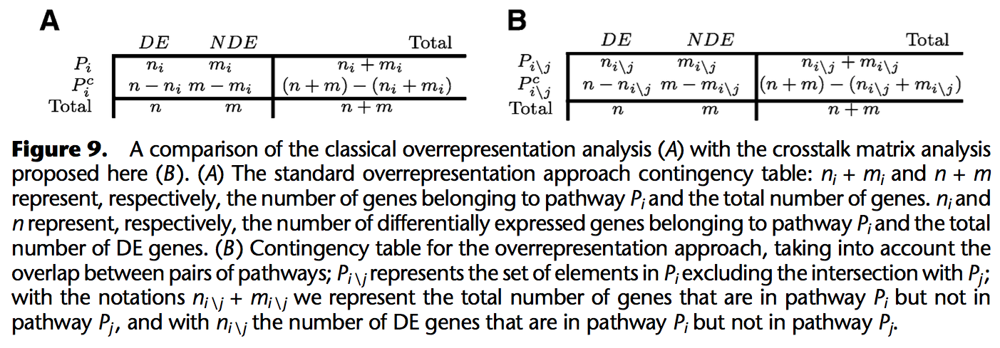

https://www.ncbi.nlm.nih.gov/pubmed/23934932

## Many GO enrichment tools

- GOStat, http://gostat.wehi.edu.au/
- GOrilla, Gene Ontology enRIchment anaLysis and visuaLizAtion tool http://cbl-gorilla.cs.technion.ac.il/
- g:Profiler, http://biit.cs.ut.ee/gprofiler/
- Metascape, http://metascape.org/
- ToppGene, https://toppgene.cchmc.org/
- WebGestals - WEB-based GEne SeT AnaLysis Toolkit, http://www.webgestalt.org/
- GeneTrails2 - gene-, protein, miRNA, genomic enrichment analysis, https://genetrail2.bioinf.uni-sb.de/
- R packages, clusterProfiler, https://www.bioconductor.org/packages/devel/bioc/html/clusterProfiler.html

## Approach 2

**Functional Class Scoring (FCS)**

- **Gene set analysis (GSA)**. Mootha et al., 2003; modified by Subramanian, et al. "**Gene set enrichment analysis: A knowledge-based approach for interpreting genome-wide expression profiles.**" PNAS 2005 http://www.pnas.org/content/102/43/15545.abstract

- Main rationale – functionally related genes often display a coordinated expression to accomplish their roles in the cells

- Aims to identify gene sets with "subtle but coordinated"  expression changes that would be missed by DEGs threshold selection

## GSEA: Gene set enrichment analysis {.larger}

- The null hypothesis is that the **rank ordering** of the genes in a given comparison is **random** with regard to the case-control assignment.

>- The alternative hypothesis is that the **rank ordering** of genes sharing functional/pathway membership is **associated** with the case-control assignment.

## GSEA: Gene set enrichment analysis

1. Sort genes by log fold change
2. Calculate running sum - increment when gene in a set, decrement when not
3. Maximum of the runnig sum is the enrichment score - larger means genes in a set are toward top of the sorted list
4. Permute subject labels to calculate significance p-value

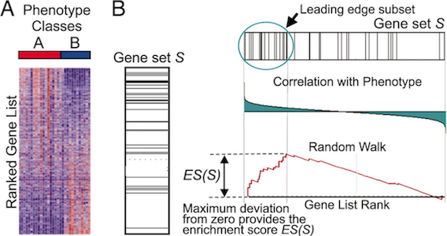

## GSEA: Gene set enrichment analysis

- Compute a statistic (difference between 2 clinical groups) for each gene that measures the degree of differential expression between treatments. 
- Create a list $L$ of all genes ordered according to these statistics. 
- Given a set of genes $S$ we can see if these genes are non-randomly distributed in our list $L$ 
- If the experiment produced random results, we don’t expect gene order to have biological coherence 

## GSEA: Gene set enrichment analysis

- Calculate an enrichment score ($ES$) that reflects the degree to which a set $S$ is overrepresented at the extremes (top or bottom) of the entire ranked list $L$. 
- The score is calculated by walking down the list $L$ and ... 
    - Increase a running-sum statistic when we encounter a gene in $S$
    - Decrease it when we encounter genes not in $S$. 

- The magnitude of the increment depends on the correlation of the gene with the phenotype.
- The final enrichment score is the maximum deviation from zero encountered in the random walk 
    - Corresponds to a weighted Kolmogorov–Smirnov-like statistics

## GSEA: Gene set enrichment analysis

**Enrichment Score**

- Consider genes $R_1, ..., R_N$ ordered by the difference metric
- Consider a gene set $S$ of size $G$, containing functionally similar genes or pathway members.
- If $R_i$ is not a member of $S$, define

$$X_{Ri}=-\sqrt{\frac{G}{N-G}}$$

- If $R_i$ is a member of $S$, define

$$X_{Ri}=\sqrt{\frac{N-G}{G}}$$

## GSEA: Gene set enrichment analysis

**Enrichment Score**

- Compute running sum across all $N$ genes. The $ES$ is defined as 

$$\max_{1 \le j \le N} \sum_{i=1}^j{X_{Ri}}$$

- or the maximum observed positive deviation of the running sum. 
- $ES$ is measured for every gene set considered. To determine whether any of the given gene sets shows association with the class phenotype distinction, permute the class labels 1,000 times, each time recording the maximum $ES$ over all gene sets. 

***

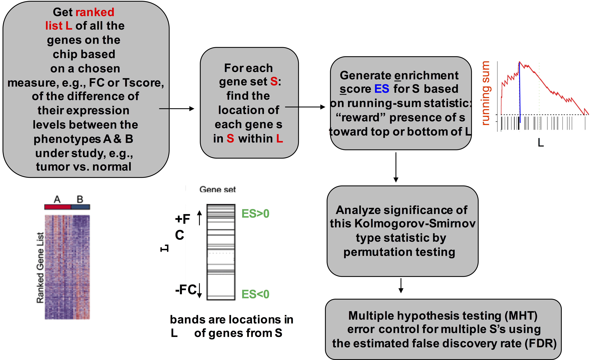

## Other approaches {.larger}

**Linear model-based**

- **CAMERA** (Wu and Smyth 2012)
- **C**orrelation-**A**djusted **ME**an **RA**nk gene set test
- Estimating the variance inflation factor associated with inter-gene correlation, and incorporating this into parametric or rank-based test procedures

## Other approaches {.larger}

**Linear model-based**

- **ROAST** (Wu et.al. 2010)
- Under the null hypothesis (and assuming a linear model) the residuals are independent and identically distributed $N(0,\sigma_g^2)$.
- We can _rotate_ the residual vector for each gene in a gene set, such that gene-gene expression correlations are preserved.

## Other approaches {.larger}

**Impact analysis** - incorporates topology of the pathway.

- Gene's fold change 
- Classical enrichment statistics
- The topology of the signaling pathway

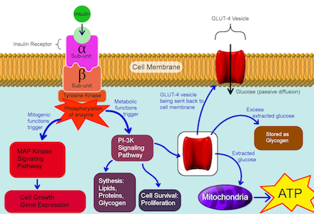

## Other approaches {.larger}

- **Pathway-Express**, <http://vortex.cs.wayne.edu/projects.htm#Pathway-Express>

Sorin Draghici et al., “A Systems Biology Approach for Pathway Level Analysis,” _Genome Research_. 2007. https://www.ncbi.nlm.nih.gov/pubmed/17785539

&nbsp;

- **SPIA**: Signaling Pathway Impact Analysis, <https://bioconductor.org/packages/release/bioc/html/SPIA.html>

Adi Laurentiu Tarca et al., “A Novel Signaling Pathway Impact Analysis,” _Bioinformatics_.  2009

## Overview {.larger}

- 
Why enrichment analysis?

- 
What is enrichment analysis?

- 
Gene ontology and pathways

- 
GENE ontology and pathways enrichment

- **Tools and references**

## Gene set enrichment analysis | Web

- **GSEA** (https://www.broadinstitute.org/gsea/index.jsp) - Better way of doing enrichment analysis
- **g:Profiler** (http://biit.cs.ut.ee/gprofiler/) - gene ID converter, GO and pathway enrichment, and more
- **ToppGene** (https://toppgene.cchmc.org) - Quick gene enrichment analysis in multiple categories
- **Metascape** (http://metascape.org/) - Enrichment analysis of multiple gene sets
- **DAVID** (https://david.ncifcrf.gov/) - Newly updated gene enrichment analysis
- **FRY** (http://shiny.bioinf.wehi.edu.au/giner.g/FRY_GeneSetExplorerApp/) - Fast Interactive Biological Pathway Miner, from WEHI group 

## Gene set enrichment analysis | DIY  {.larger}

- **clusterProfiler** (https://bioconductor.org/packages/release/bioc/html/clusterProfiler.html) - statistical analysis and visualization of functional profiles for genes and gene clusters
- **limma** (https://bioconductor.org/packages/release/bioc/html/limma.html) - Linear Models for Microarray Data, includes functional enrichment functions `goana`, `camera`, `roast`, `romer`
- **GOstats** (https://www.bioconductor.org/packages/2.8/bioc/html/GOstats.html) - tools for manimpuating GO and pathway enrichment analyses. https://github.com/mdozmorov/MDmisc/blob/master/R/gene_enrichment.R

## Gene annotation databases

- **annotables** (https://github.com/stephenturner/annotables) - R data package for annotating/converting Gene IDs
- **msigdf** (https://github.com/stephenturner/msigdf) - Molecular Signatures Database (MSigDB) in a data frame
- **pathview** (https://www.bioconductor.org/packages/devel/bioc/html/pathview.html) - a tool set for pathway based data integration and visualization

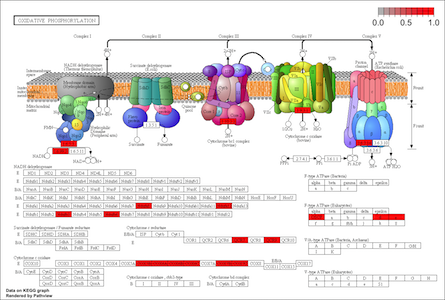

## Genomic regions enrichment analysis

- **GREAT** predicts functions of cis-regulatory regions, http://bejerano.stanford.edu/great/public/html/
- **Enrichr**, gene- and genomic regions enrichment analysis tool, http://amp.pharm.mssm.edu/Enrichr/#
- **GenomeRunner**, Functional interpretation of SNPs (any genomic regions) within regulatory/epigenomic context, http://integrativegenomics.org/

## Learn more

- Dave’s blog (http://davetang.org/muse/) search for “Gene ontology enrichment analysis” 
- Nam D., and Seon-Young K.. “**Gene-Set Approach for Expression Pattern Analysis.**” _Briefings in Bioinformatics_ 2008 https://www.ncbi.nlm.nih.gov/pubmed/18202032
- Mutation Consequences and Pathway Analysis working group. “**Pathway and Network Analysis of Cancer Genomes.**” _Nature Methods_ 2015 https://www.ncbi.nlm.nih.gov/pubmed/26125594
- Khatri, P. et.al. “**Ten Years of Pathway Analysis: Current Approaches and Outstanding Challenges.**” _PLoS Computational Biology_ 2012 https://www.ncbi.nlm.nih.gov/pubmed/22383865
- de Leeuw, C. et.al. “**The Statistical Properties of Gene-Set Analysis.**” _Nature Reviews_ 2016 https://www.ncbi.nlm.nih.gov/pubmed/27070863

***

&nbsp;

FINE

